# Mini-Agent 架构图集

本文档包含 Mini-Agent 项目的各类架构图，使用 Mermaid 格式。

---

## 1. 系统分层架构图

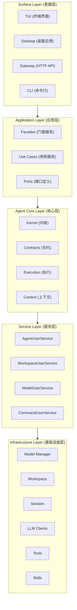

---

## 2. Agent Core 模块结构图

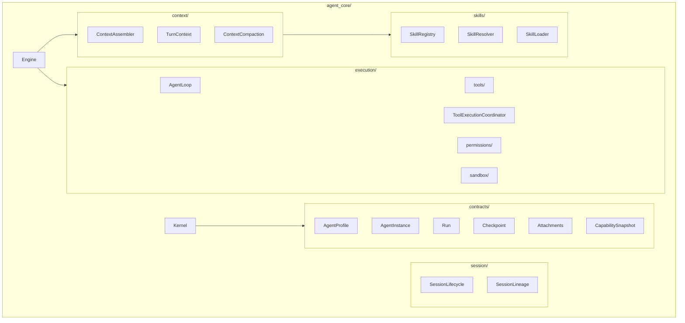

---

## 3. 模型管理器架构图

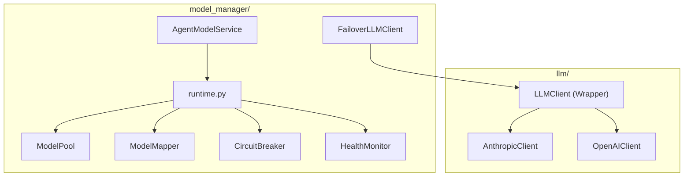

---

## 4. 运行时路由流程图

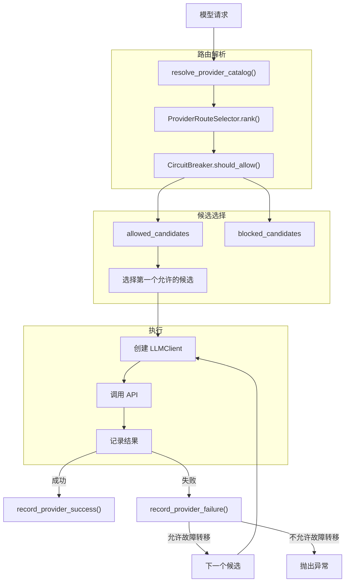

---

## 5. Agent 执行循环流程图

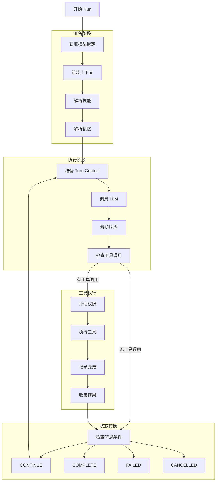

---

## 6. 工具权限评估流程图

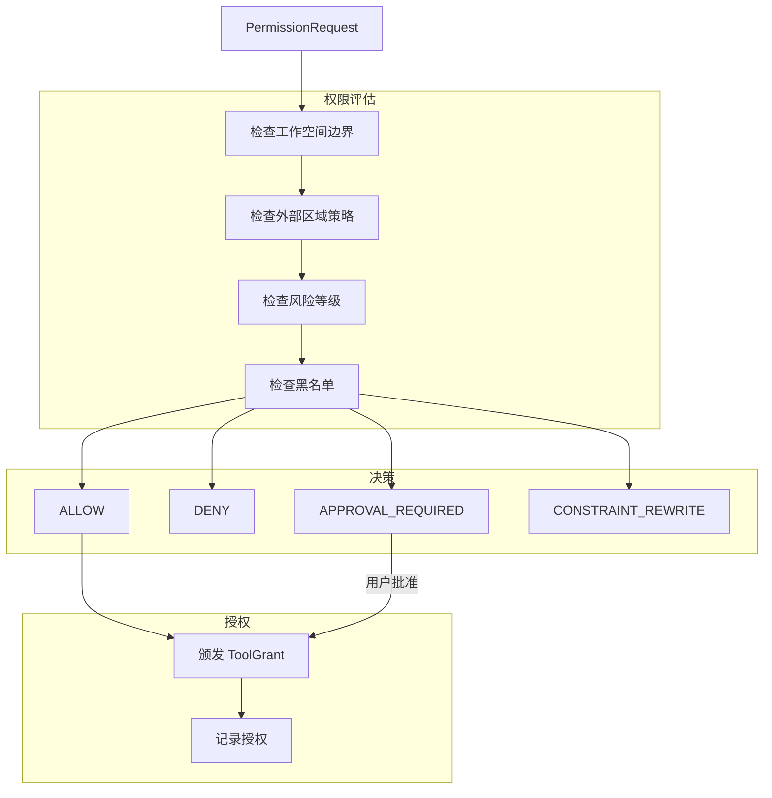

---

## 7. 三层技能解析模型图

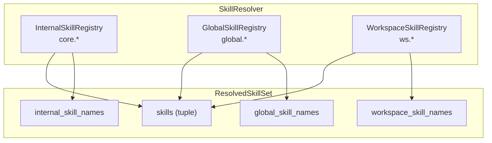

---

## 8. 熔断器状态转换图

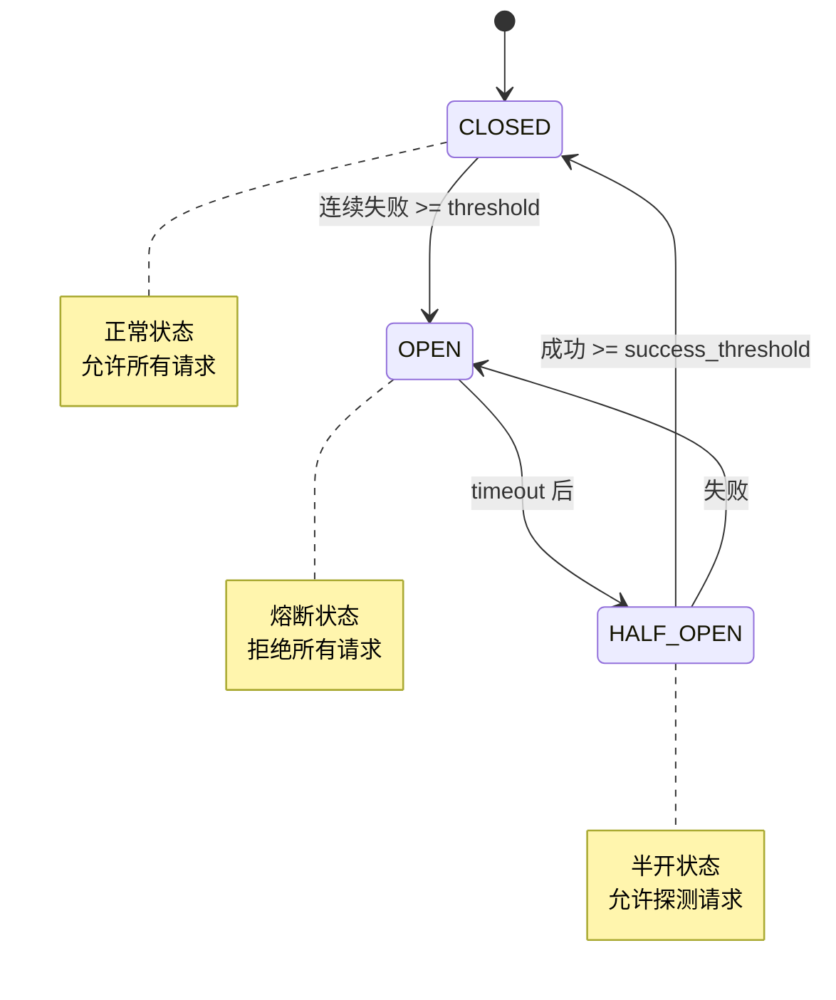

---

## 9. 会话与工作空间关系图

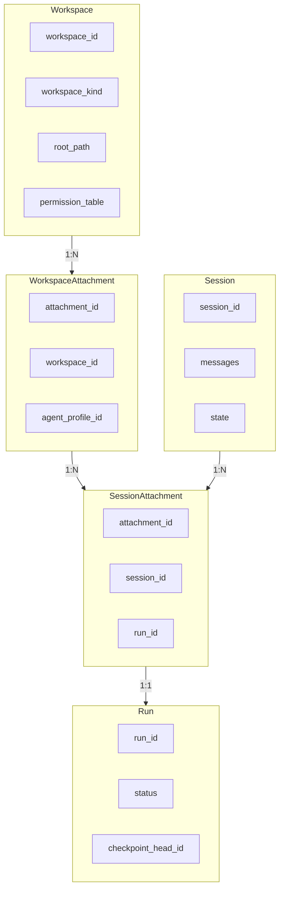

---

## 10. 数据持久化架构图

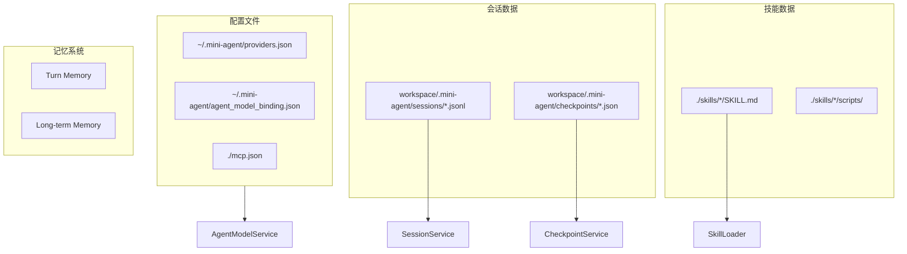

---

## 11. Gateway API 架构图

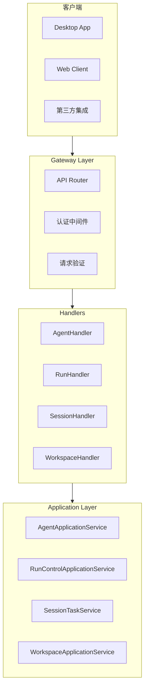

---

## 12. 模块依赖关系图

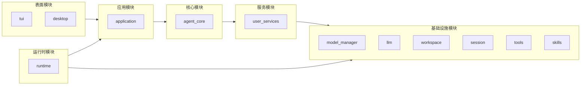

---

## 13. Agent 实体生命周期图

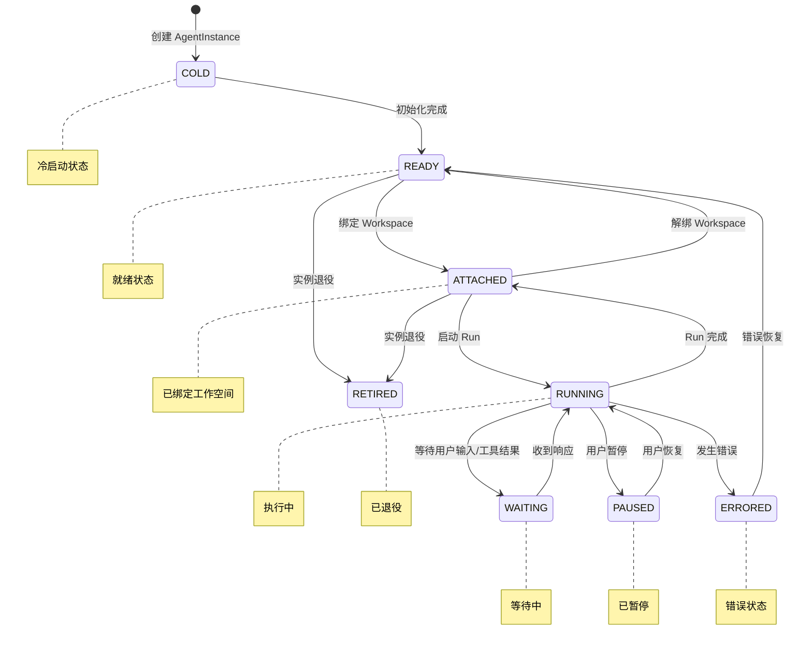

---

## 14. MCP 工具集成架构图

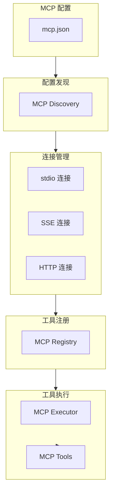

---

## 15. 上下文组装流程图

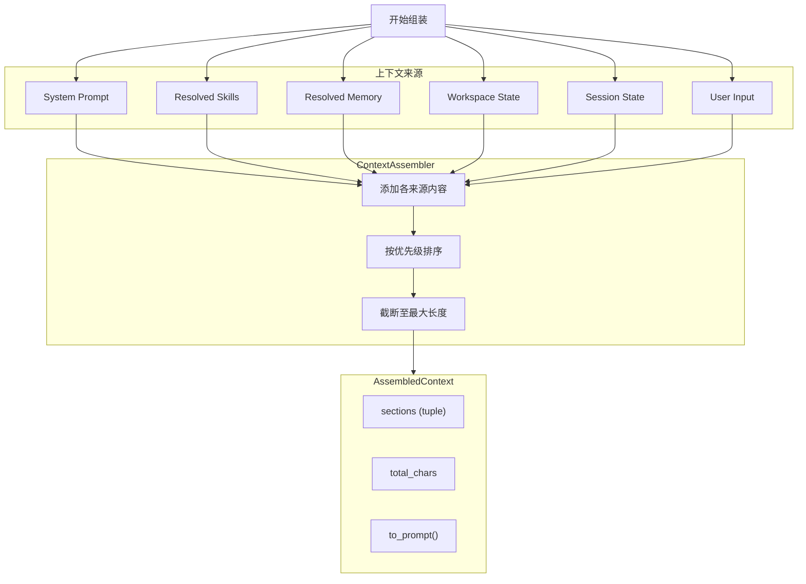