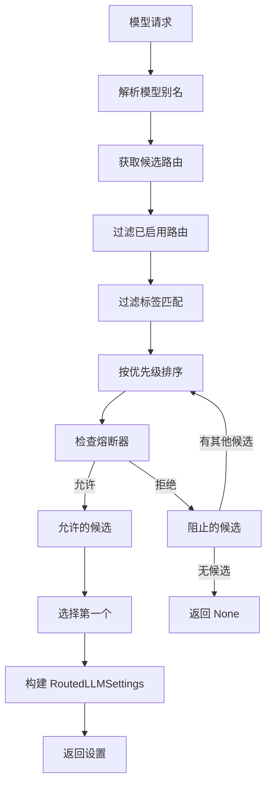
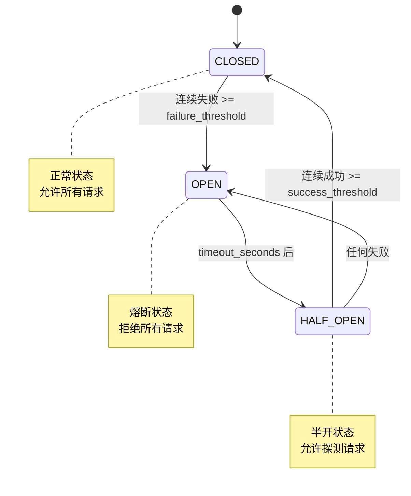
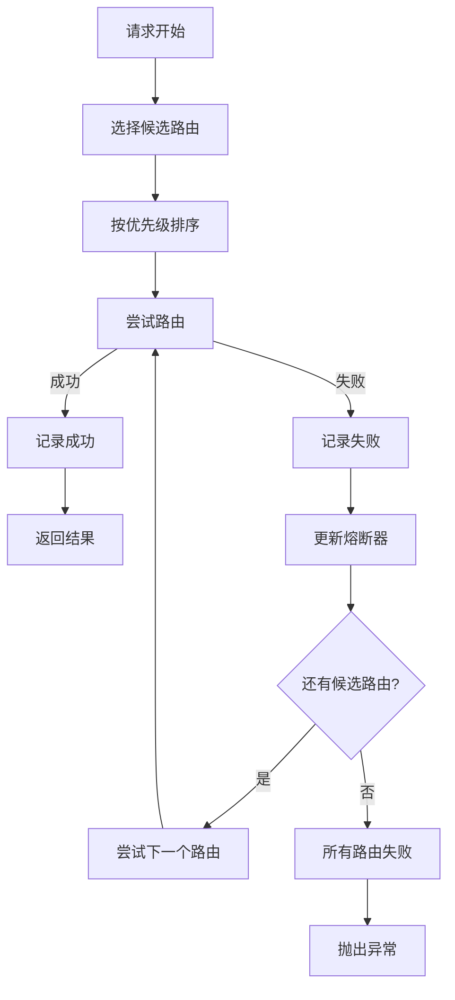

# Mini-Agent Model Manager 模块

## 1. 模块概述

`model_manager` 是 Mini-Agent 的模型管理核心，负责模型提供商注册、模型路由选择、熔断保护、健康监控等功能。

### 1.1 目录结构

```
model_manager/
├── __init__.py              # 模块导出
├── model_pool.py            # 模型池管理
├── runtime.py               # 运行时路由
├── agent_model_service.py   # Agent 模型服务
├── model_mapper.py          # 模型映射器
├── circuit_breaker.py       # 熔断器
├── health_monitor.py        # 健康监控
├── failover_client.py       # 故障转移客户端
├── provider_catalog.py      # 提供商目录
├── model_capabilities.py    # 模型能力探测
└── model_binding.py         # 模型绑定管理
```

---

## 2. 核心类定义

### 2.1 ModelPool (模型池)

```python
@dataclass(frozen=True, slots=True)
class ModelPool:
    """Central registry for all available models and their providers."""

    providers: dict[str, ProviderConfig]
    model_aliases: dict[str, str]  # alias -> canonical_id
    provider_routes: dict[str, list[ProviderRoute]]

    def get_provider(self, provider_id: str) -> ProviderConfig | None: ...
    def list_models(self) -> list[ModelInfo]: ...
    def resolve_alias(self, alias: str) -> str | None: ...
    def get_routes_for_model(self, model_id: str) -> list[ProviderRoute]: ...
```

### 2.2 ProviderConfig (提供商配置)

```python
@dataclass(frozen=True, slots=True)
class ProviderConfig:
    """Configuration for a single LLM provider."""
    provider_id: str
    provider_source: str  # "anthropic" | "openai" | "openrouter" | "ollama"
    api_key: str | None = None
    base_url: str | None = None
    models: list[str] = field(default_factory=list)
    default_model: str | None = None
    priority: int = 0
    enabled: bool = True
    metadata: dict[str, Any] = field(default_factory=dict)
```

### 2.3 ProviderRoute (提供商路由)

```python
@dataclass(frozen=True, slots=True)
class ProviderRoute:
    """Routing configuration for a model through a provider."""
    provider_id: str
    model_id: str
    provider_model_id: str  # 实际调用的模型 ID
    priority: int = 0
    weight: float = 1.0
    enabled: bool = True
    tags: set[str] = field(default_factory=set)
```

---

## 3. 运行时路由 (runtime.py)

### 3.1 RoutedLLMSettings

```python
@dataclass(frozen=True, slots=True)
class RoutedLLMSettings:
    """Resolved settings for a routed LLM call."""
    provider_id: str
    provider_source: str
    model_id: str
    provider_model_id: str
    client_config: dict[str, Any]
    route_tags: set[str]
```

### 3.2 ProviderRouteSelector

```python
class ProviderRouteSelector:
    """Selects the best provider route for a model request."""

    def __init__(self, model_pool: ModelPool, circuit_breaker: CircuitBreaker):
        ...

    def select_route(
        self,
        model_id: str,
        *,
        exclude_providers: set[str] | None = None,
        require_tags: set[str] | None = None,
    ) -> RoutedLLMSettings | None: ...

    def rank_routes(
        self,
        routes: list[ProviderRoute],
    ) -> list[ProviderRoute]: ...
```

### 3.3 路由选择流程



---

## 4. 熔断器 (circuit_breaker.py)

### 4.1 熔断器状态

```python
class CircuitState(str, Enum):
    """Circuit breaker states."""
    CLOSED = "closed"      # 正常状态，允许请求
    OPEN = "open"          # 熔断状态，拒绝请求
    HALF_OPEN = "half_open"  # 半开状态，允许探测请求
```

### 4.2 CircuitBreaker

```python
@dataclass(slots=True)
class CircuitBreaker:
    """Circuit breaker for provider health protection."""

    failure_threshold: int = 5
    success_threshold: int = 3
    timeout_seconds: float = 60.0

    # 状态
    state: CircuitState = CircuitState.CLOSED
    failure_count: int = 0
    success_count: int = 0
    last_failure_time: float | None = None

    def should_allow(self, provider_id: str) -> bool: ...
    def record_success(self, provider_id: str) -> None: ...
    def record_failure(self, provider_id: str) -> None: ...
    def get_state(self, provider_id: str) -> CircuitState: ...
```

### 4.3 状态转换图



---

## 5. 健康监控 (health_monitor.py)

### 5.1 HealthMonitor

```python
@dataclass(slots=True)
class HealthMonitor:
    """Monitors provider health and performance metrics."""

    # 指标收集
    request_counts: dict[str, int] = field(default_factory=dict)
    success_counts: dict[str, int] = field(default_factory=dict)
    failure_counts: dict[str, int] = field(default_factory=dict)
    latency_samples: dict[str, list[float]] = field(default_factory=dict)

    def record_request(self, provider_id: str, latency: float, success: bool) -> None: ...
    def get_health_status(self, provider_id: str) -> ProviderHealthStatus: ...
    def get_all_health_statuses(self) -> dict[str, ProviderHealthStatus]: ...
```

### 5.2 ProviderHealthStatus

```python
@dataclass(frozen=True, slots=True)
class ProviderHealthStatus:
    """Health status of a provider."""
    provider_id: str
    is_healthy: bool
    success_rate: float
    avg_latency: float
    p99_latency: float
    total_requests: int
    recent_failures: int
    last_success_time: float | None
    last_failure_time: float | None
```

---

## 6. 故障转移客户端 (failover_client.py)

### 6.1 FailoverLLMClient

```python
class FailoverLLMClient:
    """LLM client with automatic failover across providers."""

    def __init__(
        self,
        route_selector: ProviderRouteSelector,
        circuit_breaker: CircuitBreaker,
        health_monitor: HealthMonitor,
    ):
        ...

    async def complete(
        self,
        messages: list[dict],
        *,
        model_id: str,
        **kwargs,
    ) -> CompletionResponse: ...

    async def stream(
        self,
        messages: list[dict],
        *,
        model_id: str,
        **kwargs,
    ) -> AsyncIterator[str]: ...

    async def _try_with_failover(
        self,
        routes: list[RoutedLLMSettings],
        operation: Callable,
    ) -> Any: ...
```

### 6.2 故障转移流程



---

## 7. Agent 模型服务 (agent_model_service.py)

### 7.1 AgentModelService

```python
@dataclass(slots=True)
class AgentModelService:
    """High-level model service for agent consumption."""

    model_pool: ModelPool
    route_selector: ProviderRouteSelector
    failover_client: FailoverLLMClient
    binding_store: ModelBindingStore

    # 核心方法
    async def get_model_for_agent(self, agent_id: str) -> RoutedLLMSettings: ...
    async def complete(self, agent_id: str, messages: list[dict], **kwargs) -> CompletionResponse: ...
    async def stream(self, agent_id: str, messages: list[dict], **kwargs) -> AsyncIterator[str]: ...

    # 绑定管理
    async def get_binding(self, agent_id: str) -> ModelBinding | None: ...
    async def set_binding(self, agent_id: str, model_id: str, provider_id: str | None = None) -> None: ...
    async def list_available_models(self) -> list[ModelInfo]: ...

    # 能力查询
    async def get_capabilities(self, agent_id: str) -> ModelCapabilities: ...
    async def supports_vision(self, agent_id: str) -> bool: ...
    async def supports_tools(self, agent_id: str) -> bool: ...
```

### 7.2 ModelBinding

```python
@dataclass(frozen=True, slots=True)
class ModelBinding:
    """Binding between an agent and a model."""
    agent_id: str
    model_id: str
    provider_id: str | None = None
    created_at: float
    updated_at: float
    metadata: dict[str, Any] = field(default_factory=dict)
```

---

## 8. 模型能力探测 (model_capabilities.py)

### 8.1 ModelCapabilities

```python
@dataclass(frozen=True, slots=True)
class ModelCapabilities:
    """Detected capabilities of a model."""
    model_id: str
    provider_id: str

    # 基础能力
    supports_streaming: bool = True
    supports_tools: bool = True
    supports_vision: bool = False
    supports_audio: bool = False

    # 上下文限制
    max_context_tokens: int = 8192
    max_output_tokens: int = 4096

    # 特殊能力
    supports_system_prompt: bool = True
    supports_parallel_tools: bool = True
    supports_temperature: bool = True

    # 探测状态
    detection_status: str = "unknown"  # "unknown" | "detected" | "failed"
    detected_at: float | None = None
```

### 8.2 CapabilityDetector

```python
class CapabilityDetector:
    """Detects model capabilities through probing."""

    async def detect_capabilities(
        self,
        model_id: str,
        provider_id: str,
    ) -> ModelCapabilities: ...

    async def refresh_capabilities(
        self,
        model_id: str,
    ) -> ModelCapabilities: ...

    def get_cached_capabilities(
        self,
        model_id: str,
    ) -> ModelCapabilities | None: ...
```

---

## 9. 提供商目录 (provider_catalog.py)

### 9.1 ProviderCatalog

```python
@dataclass(slots=True)
class ProviderCatalog:
    """Catalog of all registered providers."""

    providers: dict[str, ProviderConfig] = field(default_factory=dict)
    model_aliases: dict[str, str] = field(default_factory=dict)

    def register_provider(self, config: ProviderConfig) -> None: ...
    def unregister_provider(self, provider_id: str) -> None: ...
    def get_provider(self, provider_id: str) -> ProviderConfig | None: ...
    def list_providers(self) -> list[ProviderConfig]: ...

    def resolve_model_alias(self, alias: str) -> str | None: ...
    def register_model_alias(self, alias: str, model_id: str) -> None: ...
```

### 9.2 配置加载

```python
def load_provider_catalog(path: str) -> ProviderCatalog:
    """Load provider catalog from JSON configuration file."""
    ...

def save_provider_catalog(catalog: ProviderCatalog, path: str) -> None:
    """Save provider catalog to JSON configuration file."""
    ...
```

---

## 10. 模型绑定管理 (model_binding.py)

### 10.1 ModelBindingStore

```python
class ModelBindingStore:
    """Persistent store for agent-model bindings."""

    def __init__(self, config_path: str = "~/.mini-agent/agent_model_binding.json"):
        ...

    async def get_binding(self, agent_id: str) -> ModelBinding | None: ...
    async def set_binding(self, binding: ModelBinding) -> None: ...
    async def delete_binding(self, agent_id: str) -> None: ...
    async def list_bindings(self) -> list[ModelBinding]: ...
```

### 10.2 绑定配置格式

```json
{
  "bindings": [
    {
      "agent_id": "default",
      "model_id": "claude-sonnet-4-6",
      "provider_id": "anthropic",
      "created_at": 1715328000.0,
      "updated_at": 1715328000.0
    },
    {
      "agent_id": "code-assistant",
      "model_id": "claude-opus-4-7",
      "provider_id": "anthropic"
    }
  ]
}
```

---

## 11. 设计模式

| 模式 | 应用位置 |
|------|---------|
| 策略模式 | 路由选择策略、故障转移策略 |
| 状态机 | 熔断器状态转换 |
| 观察者模式 | 健康监控、事件通知 |
| 工厂模式 | LLM 客户端创建 |
| 代理模式 | FailoverLLMClient 包装真实客户端 |
| 仓储模式 | ModelBindingStore、ProviderCatalog |

---

## 12. 与 Agent Core 的边界

### 12.1 Agent 侧职责

- 通过 `AgentModelService` 获取模型服务
- 只关心模型能力，不关心提供商细节
- 不处理故障转移和熔断逻辑

### 12.2 Model Manager 侧职责

- 管理提供商配置和模型路由
- 处理熔断和故障转移
- 探测和缓存模型能力
- 持久化模型绑定

### 12.3 接口边界

```python
# Agent Core 只依赖这个接口
class AgentModelPort(Protocol):
    """Port for agent to consume model services."""

    async def complete(self, messages: list[dict], **kwargs) -> CompletionResponse: ...
    async def stream(self, messages: list[dict], **kwargs) -> AsyncIterator[str]: ...
    async def get_capabilities(self) -> ModelCapabilities: ...
```