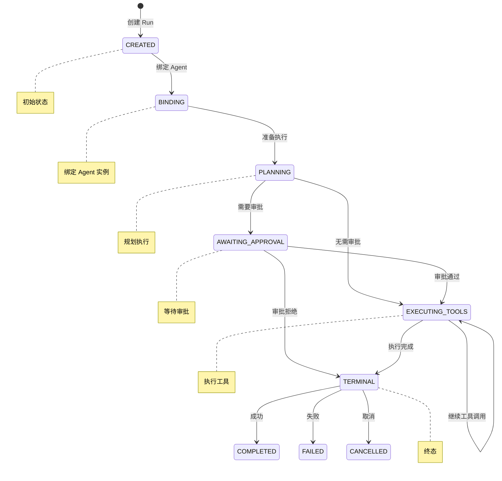
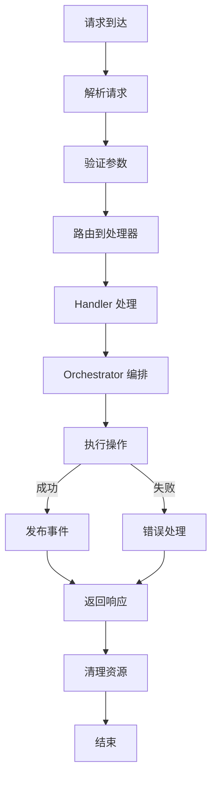

# Mini-Agent Runtime 模块

## 1. 模块概述

`runtime` 模块是 Mini-Agent 的运行时服务层，负责请求处理、会话编排、实时控制等核心运行时功能。

### 1.1 目录结构

```
runtime/
├── __init__.py              # 模块导出
├── handlers/                # 请求处理器
│   ├── agent_handler.py     # Agent 请求处理
│   ├── run_handler.py       # Run 控制处理
│   ├── session_handler.py   # Session 处理
│   └── workspace_handler.py # Workspace 处理
├── orchestration/           # 编排服务
│   ├── session_orchestrator.py
│   ├── run_orchestrator.py
│   └── agent_orchestrator.py
├── live_control/            # 实时控制
│   ├── interrupt_manager.py
│   ├── resume_manager.py
│   └── cancel_manager.py
├── state/                   # 状态管理
│   ├── runtime_state.py
│   └── state_store.py
└── events/                  # 事件系统
    ├── event_bus.py
    ├── event_types.py
    └── event_handlers.py
```

---

## 2. 请求处理器 (handlers/)

### 2.1 AgentHandler

```python
@dataclass(slots=True)
class AgentHandler:
    """Handles agent-related requests."""

    agent_service: AgentApplicationService

    async def handle_list_agents(self, request: ListAgentsRequest) -> ListAgentsResponse: ...
    async def handle_get_agent(self, request: GetAgentRequest) -> GetAgentResponse: ...
    async def handle_get_active_agent(self, request: GetActiveAgentRequest) -> GetActiveAgentResponse: ...
    async def handle_submit_message(self, request: SubmitMessageRequest) -> SubmitMessageResponse: ...
```

### 2.2 RunHandler

```python
@dataclass(slots=True)
class RunHandler:
    """Handles run control requests."""

    run_control: RunControlApplicationService

    async def handle_get_run(self, request: GetRunRequest) -> GetRunResponse: ...
    async def handle_interrupt_run(self, request: InterruptRunRequest) -> InterruptRunResponse: ...
    async def handle_resume_run(self, request: ResumeRunRequest) -> ResumeRunResponse: ...
    async def handle_cancel_run(self, request: CancelRunRequest) -> CancelRunResponse: ...
    async def handle_resolve_approval(self, request: ResolveApprovalRequest) -> ResolveApprovalResponse: ...
```

### 2.3 SessionHandler

```python
@dataclass(slots=True)
class SessionHandler:
    """Handles session-related requests."""

    session_service: SessionTaskService

    async def handle_list_sessions(self, request: ListSessionsRequest) -> ListSessionsResponse: ...
    async def handle_create_session(self, request: CreateSessionRequest) -> CreateSessionResponse: ...
    async def handle_get_session(self, request: GetSessionRequest) -> GetSessionResponse: ...
    async def handle_delete_session(self, request: DeleteSessionRequest) -> DeleteSessionResponse: ...
```

### 2.4 WorkspaceHandler

```python
@dataclass(slots=True)
class WorkspaceHandler:
    """Handles workspace-related requests."""

    workspace_service: WorkspaceApplicationService

    async def handle_list_workspaces(self, request: ListWorkspacesRequest) -> ListWorkspacesResponse: ...
    async def handle_get_workspace(self, request: GetWorkspaceRequest) -> GetWorkspaceResponse: ...
    async def handle_switch_workspace(self, request: SwitchWorkspaceRequest) -> SwitchWorkspaceResponse: ...
    async def handle_get_workspace_status(self, request: GetWorkspaceStatusRequest) -> GetWorkspaceStatusResponse: ...
```

---

## 3. 编排服务 (orchestration/)

### 3.1 SessionOrchestrator

```python
@dataclass(slots=True)
class SessionOrchestrator:
    """Orchestrates session lifecycle and run execution."""

    session_store: SessionStore
    run_orchestrator: RunOrchestrator

    async def create_session(
        self,
        *,
        workspace_id: str,
        agent_profile_id: str,
        metadata: dict | None = None,
    ) -> Session: ...

    async def get_session(self, session_id: str) -> Session | None: ...

    async def list_sessions(
        self,
        *,
        workspace_id: str | None = None,
        agent_profile_id: str | None = None,
    ) -> list[Session]: ...

    async def delete_session(self, session_id: str) -> bool: ...

    async def start_run(
        self,
        session_id: str,
        *,
        message: str,
        attachments: list[Attachment] | None = None,
    ) -> Run: ...
```

### 3.2 RunOrchestrator

```python
@dataclass(slots=True)
class RunOrchestrator:
    """Orchestrates run execution lifecycle."""

    run_store: RunStore
    agent_orchestrator: AgentOrchestrator
    interrupt_manager: InterruptManager

    async def start_run(
        self,
        *,
        session_id: str,
        agent_instance_id: str,
        message: str,
        attachments: list[Attachment] | None = None,
    ) -> Run: ...

    async def get_run(self, run_id: str) -> Run | None: ...

    async def wait_for_completion(
        self,
        run_id: str,
        *,
        timeout: float | None = None,
    ) -> Run: ...

    async def stream_events(
        self,
        run_id: str,
    ) -> AsyncIterator[RunEvent]: ...
```

### 3.3 AgentOrchestrator

```python
@dataclass(slots=True)
class AgentOrchestrator:
    """Orchestrates agent instance lifecycle."""

    instance_store: AgentInstanceStore
    profile_store: AgentProfileStore
    kernel_factory: AgentKernelFactory

    async def create_instance(
        self,
        *,
        agent_profile_id: str,
        workspace_id: str,
        session_id: str,
    ) -> AgentInstance: ...

    async def get_instance(self, instance_id: str) -> AgentInstance | None: ...

    async def start_instance(self, instance_id: str) -> None: ...

    async def stop_instance(self, instance_id: str) -> None: ...

    async def execute_turn(
        self,
        instance_id: str,
        *,
        message: str,
        attachments: list[Attachment] | None = None,
    ) -> TurnExecutionResult: ...
```

---

## 4. 实时控制 (live_control/)

### 4.1 InterruptManager

```python
@dataclass(slots=True)
class InterruptManager:
    """Manages run interruption."""

    run_store: RunStore
    event_bus: EventBus

    async def request_interrupt(
        self,
        run_id: str,
        *,
        reason: str | None = None,
        source: str | None = None,
    ) -> InterruptResult: ...

    async def check_interrupt_requested(self, run_id: str) -> bool: ...

    async def get_interrupt_status(self, run_id: str) -> InterruptStatus | None: ...
```

### 4.2 ResumeManager

```python
@dataclass(slots=True)
class ResumeManager:
    """Manages run resumption."""

    run_store: RunStore
    event_bus: EventBus

    async def request_resume(
        self,
        run_id: str,
        *,
        resume_token: str | None = None,
        source: str | None = None,
    ) -> ResumeResult: ...

    async def validate_resume_token(self, run_id: str, token: str) -> bool: ...

    async def get_resume_status(self, run_id: str) -> ResumeStatus | None: ...
```

### 4.3 CancelManager

```python
@dataclass(slots=True)
class CancelManager:
    """Manages run cancellation."""

    run_store: RunStore
    event_bus: EventBus

    async def request_cancel(
        self,
        run_id: str,
        *,
        reason: str | None = None,
        source: str | None = None,
    ) -> CancelResult: ...

    async def check_cancel_requested(self, run_id: str) -> bool: ...

    async def get_cancel_status(self, run_id: str) -> CancelStatus | None: ...
```

---

## 5. 状态管理 (state/)

### 5.1 RuntimeState

```python
@dataclass(slots=True)
class RuntimeState:
    """Global runtime state."""

    active_workspace_id: str | None = None
    active_session_id: str | None = None
    active_run_id: str | None = None
    active_agent_instance_id: str | None = None

    # 运行时统计
    total_runs: int = 0
    total_messages: int = 0
    total_tool_calls: int = 0

    # 状态时间戳
    started_at: float
    last_activity_at: float
```

### 5.2 StateStore

```python
class StateStore:
    """Persistent state storage."""

    async def load_state(self) -> RuntimeState: ...
    async def save_state(self, state: RuntimeState) -> None: ...
    async def update_state(self, updates: dict[str, Any]) -> None: ...
```

---

## 6. 事件系统 (events/)

### 6.1 EventBus

```python
class EventBus:
    """Central event bus for runtime events."""

    def __init__(self):
        self._handlers: dict[type, list[EventHandler]] = {}
        self._async_handlers: dict[type, list[AsyncEventHandler]] = {}

    def subscribe(self, event_type: type, handler: EventHandler | AsyncEventHandler) -> None: ...
    def unsubscribe(self, event_type: type, handler: EventHandler | AsyncEventHandler) -> None: ...

    def publish(self, event: Event) -> None: ...
    async def publish_async(self, event: Event) -> None: ...

    async def wait_for(
        self,
        event_type: type,
        *,
        timeout: float | None = None,
        predicate: Callable[[Event], bool] | None = None,
    ) -> Event: ...
```

### 6.2 Event Types

```python
# Run 事件
@dataclass(frozen=True)
class RunStarted(Event):
    run_id: str
    session_id: str
    agent_instance_id: str
    timestamp: float

@dataclass(frozen=True)
class RunCompleted(Event):
    run_id: str
    status: RunStatus
    result: str | None
    timestamp: float

@dataclass(frozen=True)
class RunInterrupted(Event):
    run_id: str
    reason: str | None
    timestamp: float

@dataclass(frozen=True)
class RunResumed(Event):
    run_id: str
    timestamp: float

@dataclass(frozen=True)
class RunCancelled(Event):
    run_id: str
    reason: str | None
    timestamp: float

# Tool 事件
@dataclass(frozen=True)
class ToolCallStarted(Event):
    run_id: str
    tool_name: str
    arguments: dict
    timestamp: float

@dataclass(frozen=True)
class ToolCallCompleted(Event):
    run_id: str
    tool_name: str
    result: Any
    timestamp: float

@dataclass(frozen=True)
class ToolCallFailed(Event):
    run_id: str
    tool_name: str
    error: str
    timestamp: float

# Approval 事件
@dataclass(frozen=True)
class ApprovalRequested(Event):
    run_id: str
    tool_name: str
    arguments: dict
    approval_token: str
    timestamp: float

@dataclass(frozen=True)
class ApprovalResolved(Event):
    run_id: str
    approval_token: str
    approved: bool
    timestamp: float
```

---

## 7. 运行时流程

### 7.1 Run 生命周期



### 7.2 请求处理流程



---

## 8. 与其他模块的关系

### 8.1 依赖关系

```
runtime/
├── depends on → agent_core/ (执行引擎)
├── depends on → application/ (用例服务)
├── depends on → model_manager/ (模型服务)
├── depends on → workspace/ (工作空间)
├── depends on → session/ (会话存储)
└── depends on → schema/ (数据模型)
```

### 8.2 接口边界

```python
# Runtime 对外暴露的接口
class RuntimePort(Protocol):
    """Runtime service port for surface layers."""

    # Agent 操作
    async def list_agents(self) -> list[AgentSummary]: ...
    async def get_agent(self, agent_id: str) -> AgentDetail: ...
    async def submit_message(self, request: MessageRequest) -> MessageResponse: ...

    # Run 控制
    async def get_run(self, run_id: str) -> RunDetail: ...
    async def interrupt_run(self, run_id: str, *, reason: str | None) -> None: ...
    async def resume_run(self, run_id: str, *, resume_token: str | None) -> None: ...
    async def cancel_run(self, run_id: str, *, reason: str | None) -> None: ...

    # Session 管理
    async def list_sessions(self, *, workspace_id: str | None) -> list[SessionSummary]: ...
    async def create_session(self, request: CreateSessionRequest) -> SessionDetail: ...
    async def delete_session(self, session_id: str) -> None: ...

    # Workspace 操作
    async def list_workspaces(self) -> list[WorkspaceSummary]: ...
    async def get_workspace(self, workspace_id: str) -> WorkspaceDetail: ...
    async def switch_workspace(self, workspace_id: str) -> None: ...
```

---

## 9. 设计模式

| 模式 | 应用位置 |
|------|---------|
| 编排模式 | SessionOrchestrator, RunOrchestrator |
| 观察者模式 | EventBus 事件系统 |
| 状态模式 | Run 状态转换 |
| 命令模式 | Handler 请求处理 |
| 策略模式 | 中断/恢复/取消策略 |
| 仓储模式 | StateStore, RunStore |