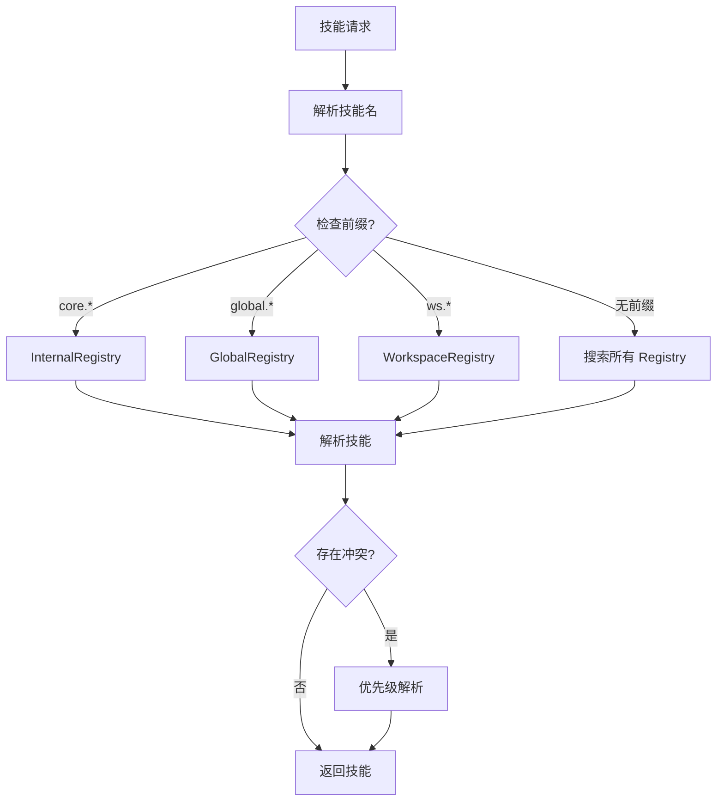

# Mini-Agent Tools & Skills 模块

## 1. 模块概述

Tools 和 Skills 是 Mini-Agent 的能力扩展系统。Tools 提供基础工具能力，Skills 提供可组合的技能包，两者共同构成 Agent 的能力矩阵。

### 1.1 Tools 目录结构

```
tools/
├── __init__.py              # 模块导出
├── base.py                  # 工具基类
├── registry.py              # 工具注册表
├── executor.py              # 工具执行器
├── permission.py            # 权限管理
├── sandbox/                 # 沙箱执行
│   ├── sandbox_executor.py
│   ├── file_sandbox.py
│   └── shell_sandbox.py
├── builtin/                 # 内置工具
│   ├── file_tools.py        # 文件操作
│   ├── shell_tools.py       # Shell 命令
│   ├── search_tools.py      # 搜索工具
│   ├── web_tools.py         # Web 工具
│   └── code_tools.py        # 代码工具
└── mcp/                     # MCP 协议
    ├── mcp_client.py
    ├── mcp_registry.py
    └── mcp_executor.py
```

### 1.2 Skills 目录结构

```
skills/
├── __init__.py              # 模块导出
├── base.py                  # 技能基类
├── registry.py              # 技能注册表
├── loader.py                # 技能加载器
├── resolver.py              # 技能解析器
├── executor.py              # 技能执行器
└── builtin/                 # 内置技能
    ├── core/                # 核心技能
    │   ├── file_operations/
    │   ├── code_analysis/
    │   └── web_search/
    └── global/              # 全局技能
        └── ...
```

---

## 2. Tools 核心类

### 2.1 Tool 基类

```python
@dataclass(frozen=True, slots=True)
class Tool:
    """Tool definition."""
    name: str
    description: str
    input_schema: dict[str, Any]  # JSON Schema
    output_schema: dict[str, Any] | None = None
    permission_level: PermissionLevel = PermissionLevel.NORMAL
    requires_approval: bool = False
    tags: set[str] = field(default_factory=set)

class PermissionLevel(str, Enum):
    """Tool permission level."""
    SAFE = "safe"           # 安全，无需审批
    NORMAL = "normal"      # 正常，可能需要审批
    DANGEROUS = "dangerous" # 危险，必须审批
    RESTRICTED = "restricted"  # 受限，特殊权限
```

### 2.2 ToolRegistry

```python
class ToolRegistry:
    """Registry for all available tools."""

    def __init__(self):
        self._tools: dict[str, Tool] = {}
        self._executors: dict[str, ToolExecutor] = {}

    def register(self, tool: Tool, executor: ToolExecutor) -> None: ...
    def unregister(self, name: str) -> None: ...
    def get(self, name: str) -> Tool | None: ...
    def get_executor(self, name: str) -> ToolExecutor | None: ...
    def list_tools(self, *, tags: set[str] | None = None) -> list[Tool]: ...
    def has_tool(self, name: str) -> bool: ...
```

### 2.3 ToolExecutor

```python
class ToolExecutor(Protocol):
    """Protocol for tool execution."""

    async def execute(
        self,
        arguments: dict[str, Any],
        *,
        context: ToolExecutionContext,
    ) -> ToolResult: ...

@dataclass(slots=True)
class ToolExecutionContext:
    """Context for tool execution."""
    workspace_id: str
    session_id: str
    run_id: str
    agent_instance_id: str
    permission_table: PermissionTable
    workspace_boundary: WorkspaceBoundary

@dataclass(frozen=True, slots=True)
class ToolResult:
    """Result of tool execution."""
    success: bool
    output: Any
    error: str | None = None
    metadata: dict[str, Any] = field(default_factory=dict)
```

---

## 3. 工具权限系统

### 3.1 PermissionEngine

```python
@dataclass(slots=True)
class PermissionEngine:
    """Engine for evaluating tool permissions."""

    permission_table: PermissionTable
    approval_cache: dict[str, ApprovalOutcome] = field(default_factory=dict)

    def evaluate(
        self,
        tool: Tool,
        arguments: dict[str, Any],
        *,
        context: ToolExecutionContext,
    ) -> PermissionDecision: ...

    def check_path_permission(
        self,
        path: str,
        operation: str,
        *,
        context: ToolExecutionContext,
    ) -> PermissionDecision: ...

    def check_command_permission(
        self,
        command: str,
        *,
        context: ToolExecutionContext,
    ) -> PermissionDecision: ...

    def record_user_decision(
        self,
        tool: Tool,
        arguments: dict[str, Any],
        decision: bool,
    ) -> None: ...
```

### 3.2 PermissionDecision

```python
class PermissionDecision(str, Enum):
    """Permission evaluation result."""
    ALLOW = "allow"               # 允许执行
    DENY = "deny"                 # 拒绝执行
    ASK = "ask"                   # 需要用户确认
    CONSTRAINT_REWRITE = "constraint_rewrite"  # 需要重写约束
```

### 3.3 ApprovalOutcome

```python
@dataclass(frozen=True, slots=True)
class ApprovalOutcome:
    """Outcome of approval request."""
    decision: PermissionDecision
    approval_token: str | None = None
    constraint_rewrite: dict[str, Any] | None = None
    reason: str | None = None
```

---

## 4. 沙箱执行

### 4.1 SandboxExecutor

```python
@dataclass(slots=True)
class SandboxExecutor:
    """Executes tools in sandboxed environment."""

    workspace_boundary: WorkspaceBoundary
    permission_engine: PermissionEngine

    async def execute(
        self,
        tool: Tool,
        arguments: dict[str, Any],
        *,
        context: ToolExecutionContext,
    ) -> ToolResult: ...

    async def execute_file_operation(
        self,
        operation: str,
        path: str,
        *,
        context: ToolExecutionContext,
    ) -> ToolResult: ...

    async def execute_shell_command(
        self,
        command: str,
        *,
        context: ToolExecutionContext,
    ) -> ToolResult: ...
```

### 4.2 FileSandbox

```python
@dataclass(slots=True)
class FileSandbox:
    """Sandbox for file operations."""

    root_path: str
    allowed_paths: set[str]
    denied_paths: set[str]

    def resolve_path(self, path: str) -> str: ...
    def is_allowed(self, path: str, operation: str) -> bool: ...
    def read_file(self, path: str) -> str: ...
    def write_file(self, path: str, content: str) -> None: ...
    def delete_file(self, path: str) -> None: ...
    def list_directory(self, path: str) -> list[str]: ...
```

### 4.3 ShellSandbox

```python
@dataclass(slots=True)
class ShellSandbox:
    """Sandbox for shell commands."""

    allowed_commands: set[str]
    denied_commands: set[str]
    env_vars: dict[str, str]

    async def execute(
        self,
        command: str,
        *,
        timeout: float = 30.0,
    ) -> ShellResult: ...

    def is_allowed(self, command: str) -> bool: ...
    def sanitize_command(self, command: str) -> str: ...

@dataclass(frozen=True, slots=True)
class ShellResult:
    """Result of shell command execution."""
    exit_code: int
    stdout: str
    stderr: str
    duration: float
```

---

## 5. 内置工具

### 5.1 文件工具

```python
# 文件读取
READ_FILE_TOOL = Tool(
    name="read_file",
    description="Read file contents",
    input_schema={
        "type": "object",
        "properties": {
            "path": {"type": "string"},
            "offset": {"type": "integer"},
            "limit": {"type": "integer"},
        },
        "required": ["path"],
    },
    permission_level=PermissionLevel.NORMAL,
)

# 文件写入
WRITE_FILE_TOOL = Tool(
    name="write_file",
    description="Write content to file",
    input_schema={
        "type": "object",
        "properties": {
            "path": {"type": "string"},
            "content": {"type": "string"},
        },
        "required": ["path", "content"],
    },
    permission_level=PermissionLevel.NORMAL,
    requires_approval=True,
)

# 文件删除
DELETE_FILE_TOOL = Tool(
    name="delete_file",
    description="Delete a file",
    input_schema={
        "type": "object",
        "properties": {
            "path": {"type": "string"},
        },
        "required": ["path"],
    },
    permission_level=PermissionLevel.DANGEROUS,
    requires_approval=True,
)
```

### 5.2 Shell 工具

```python
# Shell 执行
SHELL_EXECUTE_TOOL = Tool(
    name="shell_execute",
    description="Execute a shell command",
    input_schema={
        "type": "object",
        "properties": {
            "command": {"type": "string"},
            "timeout": {"type": "number"},
        },
        "required": ["command"],
    },
    permission_level=PermissionLevel.DANGEROUS,
    requires_approval=True,
)
```

### 5.3 搜索工具

```python
# 文件搜索
SEARCH_FILES_TOOL = Tool(
    name="search_files",
    description="Search for files matching a pattern",
    input_schema={
        "type": "object",
        "properties": {
            "pattern": {"type": "string"},
            "path": {"type": "string"},
            "file_type": {"type": "string", "enum": ["file", "directory", "all"]},
        },
        "required": ["pattern"],
    },
    permission_level=PermissionLevel.SAFE,
)

# 内容搜索
SEARCH_CONTENT_TOOL = Tool(
    name="search_content",
    description="Search for content in files",
    input_schema={
        "type": "object",
        "properties": {
            "query": {"type": "string"},
            "path": {"type": "string"},
            "file_pattern": {"type": "string"},
        },
        "required": ["query"],
    },
    permission_level=PermissionLevel.SAFE,
)
```

---

## 6. MCP 协议

### 6.1 MCPClient

```python
class MCPClient:
    """Client for Model Context Protocol."""

    async def connect(self, config: MCPConfig) -> None: ...
    async def disconnect(self) -> None: ...

    async def list_tools(self) -> list[MCPTool]: ...
    async def call_tool(
        self,
        name: str,
        arguments: dict[str, Any],
    ) -> MCPToolResult: ...

    async def list_resources(self) -> list[MCPResource]: ...
    async def read_resource(self, uri: str) -> MCPResourceContent: ...

@dataclass(frozen=True, slots=True)
class MCPConfig:
    """MCP server configuration."""
    name: str
    transport: str  # "stdio" | "sse" | "http"
    command: str | None = None  # for stdio
    url: str | None = None  # for sse/http
    env: dict[str, str] = field(default_factory=dict)
```

### 6.2 MCPRegistry

```python
class MCPRegistry:
    """Registry for MCP tools."""

    def __init__(self):
        self._clients: dict[str, MCPClient] = {}
        self._tools: dict[str, MCPTool] = {}

    async def register_server(self, config: MCPConfig) -> None: ...
    async def unregister_server(self, name: str) -> None: ...

    def get_tool(self, name: str) -> MCPTool | None: ...
    def list_tools(self) -> list[MCPTool]: ...

    async def call_tool(
        self,
        name: str,
        arguments: dict[str, Any],
    ) -> MCPToolResult: ...
```

---

## 7. Skills 核心类

### 7.1 Skill 基类

```python
@dataclass(frozen=True, slots=True)
class AgentSkill:
    """Skill definition."""
    name: str
    description: str
    instructions: str  # 技能指令
    tools: list[str] = field(default_factory=list)  # 依赖的工具
    skills: list[str] = field(default_factory=list)  # 依赖的技能
    metadata: dict[str, Any] = field(default_factory=dict)
    source: SkillSource = SkillSource.INTERNAL

class SkillSource(str, Enum):
    """Skill source classification."""
    INTERNAL = "internal"   # core.* 内置技能
    GLOBAL = "global"       # global.* 全局技能
    WORKSPACE = "workspace"  # ws.* 工作空间技能
```

### 7.2 SkillRegistry

```python
class SkillRegistry:
    """Registry resolving duplicate skills by source priority."""

    # 优先级: WORKSPACE > GLOBAL > INTERNAL
    PRIORITY = {
        SkillSource.WORKSPACE: 3,
        SkillSource.GLOBAL: 2,
        SkillSource.INTERNAL: 1,
    }

    def __init__(self):
        self._skills: dict[str, AgentSkill] = {}
        self._sources: dict[str, SkillSource] = {}

    def register(self, skill: AgentSkill) -> None: ...
    def unregister(self, name: str) -> None: ...
    def get(self, name: str) -> AgentSkill | None: ...
    def list(self, *, eligible_only: bool = False) -> list[AgentSkill]: ...
    def resolve_conflict(self, name: str, sources: list[AgentSkill]) -> AgentSkill: ...
```

### 7.3 SkillLoader

```python
class AgentSkillLoader:
    """Load skills from builtin/workspace/plugin/remote sources."""

    def __init__(self, workspace_dir: str):
        self.workspace_dir = workspace_dir
        self.internal_loader = InternalSkillLoader()
        self.global_loader = GlobalSkillLoader()
        self.workspace_loader = WorkspaceSkillLoader(workspace_dir)

    def discover(self) -> list[SkillTier1Metadata]: ...
    def get_skill(self, name: str) -> AgentSkill | None: ...
    def load_tier2(self, name: str) -> str | None: ...

@dataclass(frozen=True, slots=True)
class SkillTier1Metadata:
    """Tier 1 skill metadata (lightweight)."""
    name: str
    source: SkillSource
    path: str
    description: str
```

---

## 8. 三层技能解析

### 8.1 解析流程



### 8.2 SkillResolver

```python
@dataclass(slots=True)
class SkillResolver:
    """Resolves skills from multiple sources."""

    internal_registry: SkillRegistry
    global_registry: SkillRegistry
    workspace_registry: SkillRegistry

    def resolve(self, name: str) -> AgentSkill | None: ...
    def resolve_all(self, names: list[str]) -> ResolvedSkillSet: ...

    def resolve_dependencies(self, skill: AgentSkill) -> list[AgentSkill]: ...
    def get_skill_context(self, skill: AgentSkill) -> str: ...

@dataclass(frozen=True, slots=True)
class ResolvedSkillSet:
    """Set of resolved skills with source tracking."""
    skills: tuple[AgentSkill, ...]
    internal_skill_names: frozenset[str]
    global_skill_names: frozenset[str]
    workspace_skill_names: frozenset[str]

    def get_instructions(self) -> str: ...
    def get_all_tools(self) -> set[str]: ...
```

---

## 9. 技能文件格式

### 9.1 SKILL.md 格式

```markdown
---
name: code_analysis
description: Code analysis and refactoring skill
version: 1.0.0
author: mini-agent
tools:
  - read_file
  - write_file
  - search_files
  - search_content
skills:
  - file_operations
---

# Code Analysis Skill

## Instructions

You are a code analysis expert. Your responsibilities include:

1. Analyzing code structure and patterns
2. Identifying potential bugs and issues
3. Suggesting refactoring improvements
4. Generating documentation

## Guidelines

- Always read the full file before making changes
- Consider the broader context of the codebase
- Follow the project's coding conventions
- Document your changes clearly

## Examples

### Example 1: Function Analysis

When analyzing a function:
1. Check input validation
2. Verify error handling
3. Assess complexity
4. Look for edge cases
```

### 9.2 技能目录结构

```
skills/
├── core/
│   ├── file_operations/
│   │   └── SKILL.md
│   ├── code_analysis/
│   │   └── SKILL.md
│   └── web_search/
│       └── SKILL.md
├── global/
│   └── custom_skill/
│       └── SKILL.md
└── workspace/
    └── .mini-agent/
        └── skills/
            └── project_specific/
                └── SKILL.md
```

---

## 10. 设计模式

| 模式 | 应用位置 |
|------|---------|
| 注册表模式 | ToolRegistry, SkillRegistry |
| 策略模式 | 权限评估策略 |
| 工厂模式 | 工具/技能创建 |
| 代理模式 | 沙箱执行器 |
| 观察者模式 | 工具执行事件 |
| 责任链模式 | 权限检查链 |

---

## 11. 与 Agent Core 的集成

### 11.1 工具注入

```python
# Agent 创建时注入工具
kernel = AgentKernel(
    llm_client=llm_client,
    tools=tool_registry.list_tools(),
    skills=skill_resolver.resolve_all(skill_names),
)
```

### 11.2 技能上下文组装

```python
# ContextAssembler 组装技能指令
assembler = ContextAssembler()
assembler.add_system_prompt(system_prompt)

for skill in resolved_skills.skills:
    assembler.add_skill_context(
        skill_name=skill.name,
        instructions=skill.instructions,
    )

context = assembler.assemble(
    workspace_id=workspace_id,
    session_id=session_id,
    run_id=run_id,
)
```