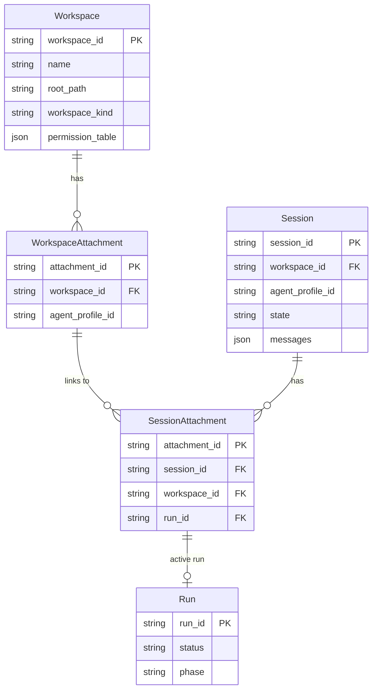
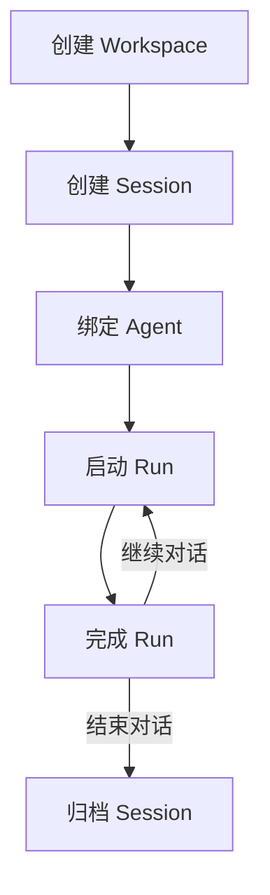

# Mini-Agent Workspace & Session 模块

## 1. 模块概述

Workspace 和 Session 模块负责 Mini-Agent 的工作空间管理和会话持久化。工作空间定义了 Agent 的操作边界和权限，会话则管理对话历史和状态。

### 1.1 Workspace 目录结构

```
workspace/
├── __init__.py              # 模块导出
├── entity.py                # Workspace 实体定义
├── store.py                 # Workspace 存储
├── manager.py               # Workspace 管理器
├── boundary.py              # 边界管理
└── permission.py            # 权限表

workspace_runtime/
├── __init__.py              # 模块导出
├── runtime.py               # 工作空间运行时
├── attachment.py            # 附件管理
├── snapshot.py              # 快照存储
└── mutation_ledger.py       # 变更账本
```

### 1.2 Session 目录结构

```
session/
├── __init__.py              # 模块导出
├── entity.py                # Session 实体定义
├── store.py                 # Session 存储
├── manager.py               # Session 管理器
├── message.py               # 消息管理
└── attachment.py            # 会话附件
```

---

## 2. Workspace 核心类

### 2.1 Workspace Entity

```python
@dataclass(frozen=True, slots=True)
class Workspace:
    """Workspace entity defining agent operation boundary."""
    workspace_id: str
    name: str
    root_path: str
    workspace_kind: WorkspaceKind = WorkspaceKind.DEFAULT
    permission_table: PermissionTable = field(default_factory=PermissionTable)
    metadata: dict[str, Any] = field(default_factory=dict)
    created_at: float = field(default_factory=time.time)
    updated_at: float = field(default_factory=time.time)

class WorkspaceKind(str, Enum):
    """Workspace type classification."""
    DEFAULT = "default"
    PROJECT = "project"
    SANDBOX = "sandbox"
    TEMPORARY = "temporary"
```

### 2.2 PermissionTable

```python
@dataclass(slots=True)
class PermissionTable:
    """Permission rules for workspace operations."""

    # 文件系统权限
    allow_read_paths: set[str] = field(default_factory=set)
    allow_write_paths: set[str] = field(default_factory=set)
    deny_paths: set[str] = field(default_factory=set)

    # 工具权限
    allowed_tools: set[str] = field(default_factory=set)
    denied_tools: set[str] = field(default_factory=set)
    ask_tools: set[str] = field(default_factory=set)

    # 网络权限
    allow_network: bool = False
    allowed_domains: set[str] = field(default_factory=set)

    # 执行权限
    allow_shell: bool = False
    allowed_commands: set[str] = field(default_factory=set)

    def check_permission(self, action: str, resource: str) -> PermissionDecision: ...
    def grant_permission(self, action: str, resource: str) -> None: ...
    def revoke_permission(self, action: str, resource: str) -> None: ...
```

### 2.3 PermissionDecision

```python
class PermissionDecision(str, Enum):
    """Permission evaluation result."""
    ALLOW = "allow"
    DENY = "deny"
    ASK = "ask"
```

---

## 3. Workspace Runtime

### 3.1 WorkspaceRuntime

```python
@dataclass(slots=True)
class WorkspaceRuntime:
    """Runtime for a single workspace."""

    workspace: Workspace
    attachment: WorkspaceAttachment | None = None

    # 运行时组件
    boundary: WorkspaceBoundary
    mutation_ledger: MutationLedger
    snapshot_store: SnapshotStore

    # 状态
    is_active: bool = False
    attached_agent_id: str | None = None

    async def activate(self) -> None: ...
    async def deactivate(self) -> None: ...

    async def attach_agent(self, agent_instance_id: str) -> None: ...
    async def detach_agent(self) -> None: ...

    def check_permission(self, action: str, resource: str) -> PermissionDecision: ...
    def record_mutation(self, mutation: Mutation) -> None: ...
```

### 3.2 WorkspaceBoundary

```python
@dataclass(slots=True)
class WorkspaceBoundary:
    """Enforces workspace access boundaries."""

    root_path: str
    permission_table: PermissionTable

    def resolve_path(self, path: str) -> str:
        """Resolve relative path to absolute path within workspace."""
        ...

    def is_within_boundary(self, path: str) -> bool:
        """Check if path is within workspace boundary."""
        ...

    def check_read_permission(self, path: str) -> PermissionDecision: ...
    def check_write_permission(self, path: str) -> PermissionDecision: ...
    def check_execute_permission(self, command: str) -> PermissionDecision: ...
```

### 3.3 MutationLedger

```python
@dataclass(slots=True)
class MutationLedger:
    """Records all mutations made during a session."""

    mutations: list[Mutation] = field(default_factory=list)
    session_id: str | None = None

    def record(self, mutation: Mutation) -> None: ...
    def get_mutations(self, *, type: str | None = None) -> list[Mutation]: ...
    def get_affected_files(self) -> set[str]: ...
    def create_rollback_plan(self) -> RollbackPlan: ...
    def clear(self) -> None: ...

@dataclass(frozen=True, slots=True)
class Mutation:
    """Single mutation record."""
    mutation_id: str
    mutation_type: str  # "file_write" | "file_delete" | "shell_exec" | ...
    target: str
    before_state: Any | None
    after_state: Any | None
    timestamp: float
    run_id: str | None = None
```

### 3.4 SnapshotStore

```python
@dataclass(slots=True)
class SnapshotStore:
    """Stores workspace snapshots for comparison and rollback."""

    snapshots_dir: str

    async def create_snapshot(
        self,
        *,
        name: str,
        paths: list[str] | None = None,
    ) -> Snapshot: ...

    async def restore_snapshot(self, snapshot_id: str) -> None: ...
    async def list_snapshots(self) -> list[Snapshot]: ...
    async def delete_snapshot(self, snapshot_id: str) -> None: ...

    async def diff_snapshots(
        self,
        snapshot_id_1: str,
        snapshot_id_2: str,
    ) -> SnapshotDiff: ...

@dataclass(frozen=True, slots=True)
class Snapshot:
    """Workspace snapshot metadata."""
    snapshot_id: str
    name: str
    created_at: float
    paths: list[str]
    size_bytes: int
```

---

## 4. Session 核心类

### 4.1 Session Entity

```python
@dataclass(slots=True)
class Session:
    """Session entity managing conversation state."""
    session_id: str
    workspace_id: str
    agent_profile_id: str

    # 消息历史
    messages: list[Message] = field(default_factory=list)

    # 状态
    state: SessionState = SessionState.ACTIVE
    created_at: float = field(default_factory=time.time)
    updated_at: float = field(default_factory=time.time)

    # 元数据
    title: str | None = None
    metadata: dict[str, Any] = field(default_factory=dict)

    # 运行时附件
    active_run_id: str | None = None

class SessionState(str, Enum):
    """Session lifecycle state."""
    ACTIVE = "active"
    ARCHIVED = "archived"
    DELETED = "deleted"
```

### 4.2 Message

```python
@dataclass(frozen=True, slots=True)
class Message:
    """Single message in a session."""
    message_id: str
    role: MessageRole
    content: str | list[ContentBlock]
    timestamp: float
    run_id: str | None = None
    metadata: dict[str, Any] = field(default_factory=dict)

class MessageRole(str, Enum):
    """Message role."""
    SYSTEM = "system"
    USER = "user"
    ASSISTANT = "assistant"
    TOOL = "tool"

@dataclass(frozen=True, slots=True)
class ContentBlock:
    """Content block in a message."""
    type: str  # "text" | "image" | "tool_use" | "tool_result"
    text: str | None = None
    source: dict | None = None  # for image
    tool_use: dict | None = None  # for tool_use
    tool_result: dict | None = None  # for tool_result
```

### 4.3 SessionStore

```python
class SessionStore:
    """Persistent storage for sessions."""

    def __init__(self, workspace_dir: str):
        self.sessions_dir = os.path.join(workspace_dir, ".mini-agent", "sessions")
        ...

    async def create_session(
        self,
        *,
        workspace_id: str,
        agent_profile_id: str,
        title: str | None = None,
    ) -> Session: ...

    async def get_session(self, session_id: str) -> Session | None: ...
    async def list_sessions(
        self,
        *,
        workspace_id: str | None = None,
        agent_profile_id: str | None = None,
        state: SessionState | None = None,
    ) -> list[Session]: ...

    async def update_session(self, session: Session) -> None: ...
    async def delete_session(self, session_id: str) -> bool: ...

    async def add_message(self, session_id: str, message: Message) -> None: ...
    async def get_messages(
        self,
        session_id: str,
        *,
        limit: int | None = None,
        before: str | None = None,
    ) -> list[Message]: ...
```

---

## 5. Session Attachment

### 5.1 SessionAttachment

```python
@dataclass(frozen=True, slots=True)
class SessionAttachment:
    """Links session to run and workspace."""
    attachment_id: str
    session_id: str
    workspace_id: str
    agent_instance_id: str
    run_id: str | None = None
    created_at: float
    metadata: dict[str, Any] = field(default_factory=dict)
```

### 5.2 AttachmentManager

```python
class AttachmentManager:
    """Manages session-workspace-run attachments."""

    async def create_attachment(
        self,
        *,
        session_id: str,
        workspace_id: str,
        agent_instance_id: str,
    ) -> SessionAttachment: ...

    async def get_attachment(self, attachment_id: str) -> SessionAttachment | None: ...
    async def get_attachment_by_session(self, session_id: str) -> SessionAttachment | None: ...

    async def attach_run(
        self,
        attachment_id: str,
        run_id: str,
    ) -> SessionAttachment: ...

    async def detach_run(self, attachment_id: str) -> SessionAttachment: ...
```

---

## 6. Workspace-Session 关系

### 6.1 关系图



### 6.2 生命周期关系



---

## 7. 持久化

### 7.1 文件结构

```
workspace/
├── .mini-agent/
│   ├── sessions/
│   │   ├── session_001.jsonl
│   │   ├── session_002.jsonl
│   │   └── ...
│   ├── checkpoints/
│   │   ├── checkpoint_001.json
│   │   ├── checkpoint_002.json
│   │   └── ...
│   ├── snapshots/
│   │   ├── snapshot_001/
│   │   │   ├── metadata.json
│   │   │   └── files/
│   │   └── ...
│   └── workspace.json
└── (workspace files)
```

### 7.2 Session 文件格式

```jsonl
{"type": "session_created", "session_id": "sess_001", "workspace_id": "ws_001", "agent_profile_id": "default", "timestamp": 1715328000.0}
{"type": "message_added", "message_id": "msg_001", "role": "user", "content": "Hello", "timestamp": 1715328001.0}
{"type": "message_added", "message_id": "msg_002", "role": "assistant", "content": "Hi!", "timestamp": 1715328002.0}
{"type": "run_started", "run_id": "run_001", "timestamp": 1715328003.0}
{"type": "run_completed", "run_id": "run_001", "status": "completed", "timestamp": 1715328010.0}
```

---

## 8. Memory 系统

### 8.1 Memory 架构

```python
@dataclass(slots=True)
class MemoryStore:
    """Three-layer memory system."""

    # 工作记忆 (当前对话)
    working_memory: WorkingMemory

    # 短期记忆 (近期会话)
    short_term_memory: ShortTermMemory

    # 长期记忆 (持久化)
    long_term_memory: LongTermMemory

    async def add_memory(self, content: str, *, importance: float = 0.5) -> None: ...
    async def search_memories(self, query: str, *, limit: int = 10) -> list[Memory]: ...
    async def consolidate_memories(self) -> None: ...
```

### 8.2 WorkingMemory

```python
@dataclass(slots=True)
class WorkingMemory:
    """In-context memory for current conversation."""

    messages: list[Message] = field(default_factory=list)
    context_window_tokens: int = 80000
    current_tokens: int = 0

    def add_message(self, message: Message) -> None: ...
    def compact(self, *, preserve_recent: int = 10) -> CompactionResult: ...
    def get_context(self) -> str: ...
```

### 8.3 ShortTermMemory

```python
@dataclass(slots=True)
class ShortTermMemory:
    """Recent session memory."""

    memories: list[Memory] = field(default_factory=list)
    max_memories: int = 100
    ttl_seconds: float = 86400.0  # 24 hours

    def add_memory(self, memory: Memory) -> None: ...
    def get_relevant(self, query: str, *, limit: int = 10) -> list[Memory]: ...
    def expire_old_memories(self) -> int: ...
```

### 8.4 LongTermMemory

```python
@dataclass(slots=True)
class LongTermMemory:
    """Persistent memory storage."""

    storage_path: str
    embedding_model: str = "text-embedding-3-small"

    async def store_memory(self, memory: Memory) -> str: ...
    async def search_memories(
        self,
        query: str,
        *,
        limit: int = 10,
        threshold: float = 0.7,
    ) -> list[Memory]: ...
    async def delete_memory(self, memory_id: str) -> bool: ...
```

---

## 9. 设计模式

| 模式 | 应用位置 |
|------|---------|
| 仓储模式 | SessionStore, WorkspaceStore |
| 快照模式 | SnapshotStore |
| 账本模式 | MutationLedger |
| 边界模式 | WorkspaceBoundary |
| 状态模式 | SessionState, WorkspaceState |
| 观察者模式 | Session 事件通知 |