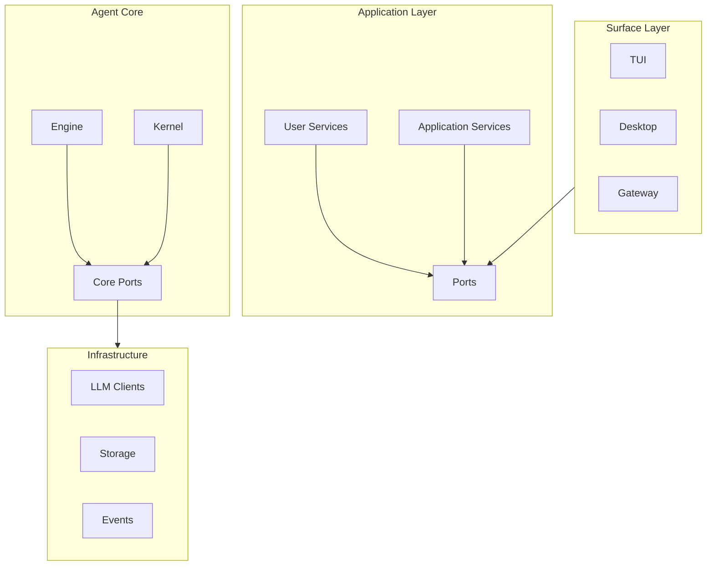

# Mini-Agent 核心接口定义

## 1. 概述

本文档定义 Mini-Agent 各层之间的核心接口（Port）。所有接口遵循依赖倒置原则，定义为 `Protocol`，确保接口契约与实现解耦。

---

## 2. Application Layer Ports

### 2.1 AgentRuntimePort

```python
class AgentRuntimePort(Protocol):
    """Application-facing contract for agent runtime queries."""

    async def list_agents(self) -> list[AgentSummary]:
        """List all available agents."""
        ...

    async def get_agent(self, agent_id: str) -> AgentDetail | None:
        """Get detailed information for a specific agent."""
        ...

    async def get_active_agent(self) -> AgentDetail | None:
        """Get the currently active agent."""
        ...
```

### 2.2 RunRuntimePort

```python
class RunRuntimePort(Protocol):
    """Application-facing contract for active run queries and control."""

    async def get_run(self, run_id: str) -> RunDetail | None:
        """Get detailed information for a specific run."""
        ...

    async def interrupt_run(
        self,
        run_id: str,
        *,
        reason: str | None = None,
        source: str | None = None,
    ) -> InterruptResult:
        """Request interruption of an active run."""
        ...

    async def resume_run(
        self,
        run_id: str,
        *,
        resume_token: str | None = None,
        source: str | None = None,
    ) -> ResumeResult:
        """Resume a paused or waiting run."""
        ...

    async def cancel_run(
        self,
        run_id: str,
        *,
        reason: str | None = None,
        source: str | None = None,
    ) -> CancelResult:
        """Cancel an active run."""
        ...

    async def resolve_approval_wait(
        self,
        run_id: str,
        *,
        approved: bool,
        token: str | None = None,
        modifications: dict | None = None,
    ) -> ApprovalResolutionResult:
        """Resolve a pending approval request."""
        ...
```

### 2.3 WorkspaceRuntimePort

```python
class WorkspaceRuntimePort(Protocol):
    """Application-facing contract for workspace queries and management."""

    async def list_workspaces(self) -> list[WorkspaceSummary]:
        """List all available workspaces."""
        ...

    async def get_workspace(self, workspace_id: str) -> WorkspaceDetail | None:
        """Get detailed information for a specific workspace."""
        ...

    async def get_active_workspace(self) -> WorkspaceDetail | None:
        """Get the currently active workspace."""
        ...

    async def switch_workspace(
        self,
        workspace_id: str,
    ) -> SwitchWorkspaceResult:
        """Switch to a different workspace."""
        ...

    async def get_workspace_status(
        self,
        workspace_id: str,
    ) -> WorkspaceStatus:
        """Get status information for a workspace."""
        ...
```

### 2.4 ModelRuntimePort

```python
class ModelRuntimePort(Protocol):
    """Application-facing contract for agent model selection and capability views."""

    async def list_model_bindings(self) -> list[ModelBinding]:
        """List all model bindings."""
        ...

    async def get_model_binding(
        self,
        agent_id: str | None = None,
    ) -> ModelBinding | None:
        """Get model binding for a specific agent."""
        ...

    async def update_model_binding(
        self,
        *,
        agent_id: str,
        provider_source: str | None = None,
        provider_id: str | None = None,
        model_id: str,
    ) -> ModelBinding:
        """Update model binding for an agent."""
        ...

    async def list_model_capabilities(
        self,
        agent_id: str | None = None,
    ) -> list[ModelCapabilities]:
        """List capabilities of models available to an agent."""
        ...

    async def get_model_binding_diagnostics(
        self,
        agent_id: str | None = None,
    ) -> ModelBindingDiagnostics:
        """Get diagnostic information for model binding."""
        ...
```

### 2.5 SessionAgentRuntimePort

```python
class SessionAgentRuntimePort(Protocol):
    """Application-facing contract for session-level agent operations."""

    async def list_sessions(
        self,
        *,
        workspace_id: str | None = None,
        agent_profile_id: str | None = None,
    ) -> list[SessionSummary]:
        """List sessions with optional filters."""
        ...

    async def get_session(
        self,
        session_id: str,
    ) -> SessionDetail | None:
        """Get detailed information for a specific session."""
        ...

    async def create_session(
        self,
        request: CreateSessionRequest,
    ) -> SessionDetail:
        """Create a new session."""
        ...

    async def delete_session(
        self,
        session_id: str,
    ) -> DeleteSessionResult:
        """Delete a session."""
        ...
```

### 2.6 SessionTaskPort

```python
class SessionTaskPort(Protocol):
    """Application-facing contract for session to run mapping."""

    async def get_active_run_for_session(
        self,
        session_id: str,
    ) -> RunDetail | None:
        """Get the active run for a session."""
        ...

    async def get_runs_for_session(
        self,
        session_id: str,
        *,
        limit: int = 10,
    ) -> list[RunSummary]:
        """Get recent runs for a session."""
        ...

    async def create_run_for_session(
        self,
        session_id: str,
        *,
        message: str,
        attachments: list[Attachment] | None = None,
    ) -> RunDetail:
        """Create a new run for a session."""
        ...
```

### 2.7 SessionTaskRuntimePort

```python
class SessionTaskRuntimePort(Protocol):
    """Application-facing contract for session task runtime management."""

    async def prepare_chat_turn(
        self,
        *,
        workspace_id: str,
        session_id: str,
        message: str,
        attachments: list[Attachment] | None = None,
    ) -> PreparedTurn:
        """Prepare a chat turn for execution."""
        ...

    async def execute_chat_turn(
        self,
        turn: PreparedTurn,
    ) -> TurnExecutionResult:
        """Execute a prepared chat turn."""
        ...

    async def stream_chat_turn(
        self,
        turn: PreparedTurn,
    ) -> AsyncIterator[ChatEvent]:
        """Stream events from chat turn execution."""
        ...
```

---

## 3. Agent Core Ports

### 3.1 AgentModelPort

```python
class AgentModelPort(Protocol):
    """Port for agent to consume model services."""

    async def complete(
        self,
        messages: list[dict],
        *,
        tools: list[Tool] | None = None,
        system_prompt: str | None = None,
        **kwargs,
    ) -> CompletionResponse:
        """Generate a completion."""
        ...

    async def stream(
        self,
        messages: list[dict],
        *,
        tools: list[Tool] | None = None,
        system_prompt: str | None = None,
        **kwargs,
    ) -> AsyncIterator[StreamChunk]:
        """Stream completion chunks."""
        ...

    async def get_capabilities(self) -> ModelCapabilities:
        """Get model capabilities."""
        ...
```

### 3.2 AgentToolPort

```python
class AgentToolPort(Protocol):
    """Port for agent to access tools."""

    def list_tools(self) -> list[Tool]:
        """List available tools."""
        ...

    async def execute_tool(
        self,
        name: str,
        arguments: dict[str, Any],
        *,
        context: ToolExecutionContext,
    ) -> ToolResult:
        """Execute a tool."""
        ...

    def get_tool_schema(self, name: str) -> dict:
        """Get JSON schema for a tool."""
        ...
```

### 3.3 AgentSkillPort

```python
class AgentSkillPort(Protocol):
    """Port for agent to access skills."""

    def list_skills(self) -> list[AgentSkill]:
        """List available skills."""
        ...

    def get_skill(self, name: str) -> AgentSkill | None:
        """Get a specific skill."""
        ...

    def resolve_skills(
        self,
        names: list[str],
    ) -> ResolvedSkillSet:
        """Resolve a set of skills."""
        ...

    def get_skill_instructions(
        self,
        skill: AgentSkill,
    ) -> str:
        """Get instructions for a skill."""
        ...
```

### 3.4 AgentContextPort

```python
class AgentContextPort(Protocol):
    """Port for agent context management."""

    def add_system_prompt(self, content: str) -> ContextSection:
        """Add system prompt section."""
        ...

    def add_skill_context(
        self,
        skill_name: str,
        instructions: str,
    ) -> ContextSection:
        """Add skill context section."""
        ...

    def add_memory_context(self, content: str) -> ContextSection:
        """Add memory context section."""
        ...

    def add_workspace_context(self, content: str) -> ContextSection:
        """Add workspace context section."""
        ...

    def add_session_context(self, content: str) -> ContextSection:
        """Add session context section."""
        ...

    def add_user_context(self, content: str) -> ContextSection:
        """Add user context section."""
        ...

    def assemble(
        self,
        *,
        workspace_id: str,
        session_id: str,
        run_id: str,
    ) -> AssembledContext:
        """Assemble all context sections."""
        ...
```

### 3.5 AgentMemoryPort

```python
class AgentMemoryPort(Protocol):
    """Port for agent memory management."""

    async def add_memory(
        self,
        content: str,
        *,
        importance: float = 0.5,
        metadata: dict | None = None,
    ) -> str:
        """Add a memory entry."""
        ...

    async def search_memories(
        self,
        query: str,
        *,
        limit: int = 10,
        threshold: float = 0.7,
    ) -> list[Memory]:
        """Search relevant memories."""
        ...

    async def get_recent_memories(
        self,
        *,
        limit: int = 10,
    ) -> list[Memory]:
        """Get recent memories."""
        ...

    async def consolidate_memories(self) -> int:
        """Consolidate memories from STM to LTM."""
        ...
```

---

## 4. Infrastructure Ports

### 4.1 LLMClientPort

```python
class LLMClientPort(Protocol):
    """Port for LLM client implementations."""

    async def complete(
        self,
        messages: list[dict],
        *,
        model: str,
        tools: list[dict] | None = None,
        system_prompt: str | None = None,
        temperature: float = 1.0,
        max_tokens: int = 4096,
        **kwargs,
    ) -> CompletionResponse:
        """Generate a completion."""
        ...

    async def stream(
        self,
        messages: list[dict],
        *,
        model: str,
        tools: list[dict] | None = None,
        system_prompt: str | None = None,
        temperature: float = 1.0,
        max_tokens: int = 4096,
        **kwargs,
    ) -> AsyncIterator[StreamChunk]:
        """Stream completion chunks."""
        ...

    def count_tokens(
        self,
        messages: list[dict],
    ) -> int:
        """Count tokens in messages."""
        ...
```

### 4.2 StoragePort

```python
class StoragePort(Protocol):
    """Port for storage implementations."""

    async def read(self, key: str) -> bytes | None:
        """Read data by key."""
        ...

    async def write(
        self,
        key: str,
        data: bytes,
    ) -> None:
        """Write data by key."""
        ...

    async def delete(self, key: str) -> bool:
        """Delete data by key."""
        ...

    async def list_keys(
        self,
        prefix: str | None = None,
    ) -> list[str]:
        """List keys with optional prefix filter."""
        ...
```

### 4.3 EventPort

```python
class EventPort(Protocol):
    """Port for event publishing."""

    def publish(self, event: Event) -> None:
        """Publish an event."""
        ...

    async def publish_async(self, event: Event) -> None:
        """Publish an event asynchronously."""
        ...

    def subscribe(
        self,
        event_type: type,
        handler: EventHandler | AsyncEventHandler,
    ) -> None:
        """Subscribe to events."""
        ...

    def unsubscribe(
        self,
        event_type: type,
        handler: EventHandler | AsyncEventHandler,
    ) -> None:
        """Unsubscribe from events."""
        ...
```

---

## 5. Surface Layer Ports

### 5.1 SurfacePort

```python
class SurfacePort(Protocol):
    """Port for surface layer implementations (TUI, Desktop, Gateway)."""

    async def display_message(
        self,
        message: str,
        *,
        role: str = "assistant",
    ) -> None:
        """Display a message to the user."""
        ...

    async def display_error(
        self,
        error: str,
    ) -> None:
        """Display an error to the user."""
        ...

    async def request_approval(
        self,
        request: ApprovalRequest,
    ) -> ApprovalResponse:
        """Request user approval for an action."""
        ...

    async def get_user_input(
        self,
        prompt: str | None = None,
    ) -> str:
        """Get input from the user."""
        ...

    async def display_tool_execution(
        self,
        tool_name: str,
        arguments: dict,
        result: Any,
    ) -> None:
        """Display tool execution details."""
        ...
```

### 5.2 CommandPort

```python
class CommandPort(Protocol):
    """Port for command handling."""

    async def discover_commands(self) -> list[CommandInfo]:
        """Discover available commands."""
        ...

    async def get_command_description(
        self,
        command: str,
    ) -> CommandDescription | None:
        """Get description for a command."""
        ...

    async def complete_command(
        self,
        partial: str,
    ) -> list[str]:
        """Get command completions."""
        ...

    async def dispatch_command(
        self,
        command: str,
        args: list[str],
    ) -> CommandResult:
        """Dispatch a command for execution."""
        ...
```

---

## 6. 接口依赖关系



---

## 7. 接口设计原则

### 7.1 依赖倒置

- 上层模块依赖 Port 协议，而非具体实现
- Port 定义在消费层，实现在提供层
- 通过依赖注入组装具体实现

### 7.2 接口隔离

- 每个 Port 只暴露必要的方法
- 避免"胖接口"，按职责拆分
- 客户端不应依赖它不使用的方法

### 7.3 单一职责

- 每个 Port 专注于单一领域
- 方法命名清晰表达意图
- 避免跨领域的混合接口

### 7.4 开闭原则

- 通过扩展 Port 添加新功能
- 不修改现有 Port 定义
- 使用组合而非继承