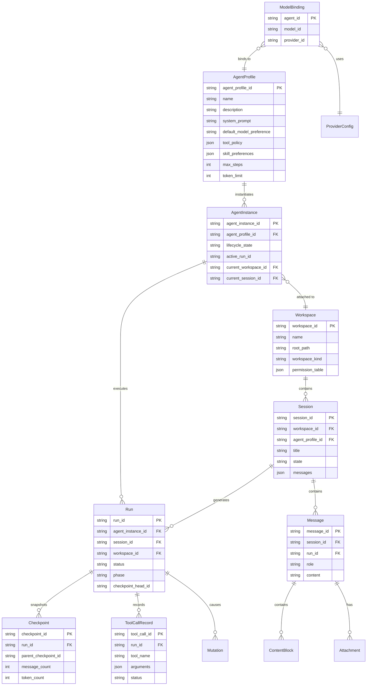

# Mini-Agent 数据模型

## 1. 概述

本文档详细描述 Mini-Agent 的核心数据模型，包括实体关系、字段定义、约束条件等。

---

## 2. 实体关系图

---

## 3. Agent 数据模型

### 3.1 AgentProfile

| 字段 | 类型 | 约束 | 说明 |
|------|------|------|------|
| `agent_profile_id` | `str` | PK, NOT NULL | 唯一标识符 |
| `name` | `str` | NOT NULL | Agent 名称 |
| `description` | `str` | DEFAULT '' | 描述 |
| `system_prompt` | `str` | DEFAULT '' | 系统提示词 |
| `default_model_preference` | `str \| None` | | 默认模型偏好 |
| `tool_policy` | `dict[str, Any]` | DEFAULT {} | 工具策略 |
| `skill_preferences` | `dict[str, Any]` | DEFAULT {} | 技能偏好 |
| `max_steps` | `int` | DEFAULT 50 | 最大步数 |
| `max_tool_calls_per_step` | `int \| None` | | 每步最大工具调用 |
| `token_limit` | `int` | DEFAULT 80000 | Token 限制 |
| `metadata` | `dict[str, Any]` | DEFAULT {} | 元数据 |

**约束**

- `agent_profile_id` 全局唯一
- `max_steps` > 0
- `token_limit` > 0

### 3.2 AgentInstance

| 字段 | 类型 | 约束 | 说明 |
|------|------|------|------|
| `agent_instance_id` | `str` | PK, NOT NULL | 唯一标识符 |
| `agent_profile_id` | `str` | FK, NOT NULL | 关联 Profile |
| `lifecycle_state` | `AgentInstanceLifecycleState` | NOT NULL | 生命周期状态 |
| `active_run_id` | `str \| None` | FK | 活跃 Run |
| `current_workspace_id` | `str \| None` | FK | 当前工作空间 |
| `current_session_id` | `str \| None` | FK | 当前会话 |
| `created_at` | `float` | NOT NULL | 创建时间 |
| `updated_at` | `float` | NOT NULL | 更新时间 |

**状态约束**

- `lifecycle_state = RUNNING` → `active_run_id IS NOT NULL`
- `lifecycle_state = ATTACHED` → `current_workspace_id IS NOT NULL`

---

## 4. Run 数据模型

### 4.1 Run

| 字段 | 类型 | 约束 | 说明 |
|------|------|------|------|
| `run_id` | `str` | PK, NOT NULL | 唯一标识符 |
| `agent_instance_id` | `str` | FK, NOT NULL | 执行 Agent |
| `session_id` | `str` | FK, NOT NULL | 所属会话 |
| `workspace_id` | `str` | FK, NOT NULL | 所属工作空间 |
| `status` | `RunStatus` | NOT NULL | 执行状态 |
| `phase` | `RunPhase` | NOT NULL | 执行阶段 |
| `checkpoint_head_id` | `str \| None` | FK | 最新检查点 |
| `parent_run_id` | `str \| None` | FK | 父 Run |
| `created_at` | `float` | NOT NULL | 创建时间 |
| `updated_at` | `float` | NOT NULL | 更新时间 |
| `completed_at` | `float \| None` | | 完成时间 |
| `error_message` | `str \| None` | | 错误信息 |
| `metadata` | `dict[str, Any]` | DEFAULT {} | 元数据 |

**状态约束**

- `status = COMPLETED` → `completed_at IS NOT NULL`
- `status = FAILED` → `error_message IS NOT NULL`

### 4.2 Checkpoint

| 字段 | 类型 | 约束 | 说明 |
|------|------|------|------|
| `checkpoint_id` | `str` | PK, NOT NULL | 唯一标识符 |
| `run_id` | `str` | FK, NOT NULL | 所属 Run |
| `parent_checkpoint_id` | `str \| None` | FK | 父检查点 |
| `message_count` | `int` | DEFAULT 0 | 消息数量 |
| `tool_call_count` | `int` | DEFAULT 0 | 工具调用数量 |
| `token_count` | `int` | DEFAULT 0 | Token 数量 |
| `created_at` | `float` | NOT NULL | 创建时间 |
| `snapshot` | `dict[str, Any]` | DEFAULT {} | 快照数据 |

---

## 5. Workspace 数据模型

### 5.1 Workspace

| 字段 | 类型 | 约束 | 说明 |
|------|------|------|------|
| `workspace_id` | `str` | PK, NOT NULL | 唯一标识符 |
| `name` | `str` | NOT NULL | 工作空间名称 |
| `root_path` | `str` | NOT NULL, UNIQUE | 根目录路径 |
| `workspace_kind` | `WorkspaceKind` | DEFAULT 'default' | 类型 |
| `permission_table` | `PermissionTable` | NOT NULL | 权限表 |
| `metadata` | `dict[str, Any]` | DEFAULT {} | 元数据 |
| `created_at` | `float` | NOT NULL | 创建时间 |
| `updated_at` | `float` | NOT NULL | 更新时间 |

### 5.2 PermissionTable

| 字段 | 类型 | 约束 | 说明 |
|------|------|------|------|
| `allow_read_paths` | `set[str]` | DEFAULT {} | 允许读取路径 |
| `allow_write_paths` | `set[str]` | DEFAULT {} | 允许写入路径 |
| `deny_paths` | `set[str]` | DEFAULT {} | 禁止访问路径 |
| `allowed_tools` | `set[str]` | DEFAULT {} | 允许工具 |
| `denied_tools` | `set[str]` | DEFAULT {} | 禁止工具 |
| `ask_tools` | `set[str]` | DEFAULT {} | 需确认工具 |
| `allow_network` | `bool` | DEFAULT False | 允许网络 |
| `allowed_domains` | `set[str]` | DEFAULT {} | 允许域名 |
| `allow_shell` | `bool` | DEFAULT False | 允许 Shell |
| `allowed_commands` | `set[str]` | DEFAULT {} | 允许命令 |

---

## 6. Session 数据模型

### 6.1 Session

| 字段 | 类型 | 约束 | 说明 |
|------|------|------|------|
| `session_id` | `str` | PK, NOT NULL | 唯一标识符 |
| `workspace_id` | `str` | FK, NOT NULL | 所属工作空间 |
| `agent_profile_id` | `str` | FK, NOT NULL | Agent 配置 |
| `messages` | `list[Message]` | DEFAULT [] | 消息列表 |
| `state` | `SessionState` | DEFAULT 'active' | 状态 |
| `title` | `str \| None` | | 标题 |
| `active_run_id` | `str \| None` | FK | 活跃 Run |
| `created_at` | `float` | NOT NULL | 创建时间 |
| `updated_at` | `float` | NOT NULL | 更新时间 |
| `metadata` | `dict[str, Any]` | DEFAULT {} | 元数据 |

### 6.2 Message

| 字段 | 类型 | 约束 | 说明 |
|------|------|------|------|
| `message_id` | `str` | PK, NOT NULL | 唯一标识符 |
| `role` | `MessageRole` | NOT NULL | 角色 |
| `content` | `str \| list[ContentBlock]` | NOT NULL | 内容 |
| `timestamp` | `float` | NOT NULL | 时间戳 |
| `run_id` | `str \| None` | FK | 所属 Run |
| `metadata` | `dict[str, Any]` | DEFAULT {} | 元数据 |

### 6.3 ContentBlock

| 字段 | 类型 | 约束 | 说明 |
|------|------|------|------|
| `type` | `ContentBlockType` | NOT NULL | 类型 |
| `text` | `str \| None` | | 文本内容 |
| `source` | `dict \| None` | | 图片源 |
| `tool_use` | `ToolUseBlock \| None` | | 工具调用 |
| `tool_result` | `ToolResultBlock \| None` | | 工具结果 |

---

## 7. Tool 数据模型

### 7.1 Tool

| 字段 | 类型 | 约束 | 说明 |
|------|------|------|------|
| `name` | `str` | PK, NOT NULL | 工具名称 |
| `description` | `str` | NOT NULL | 描述 |
| `input_schema` | `dict[str, Any]` | NOT NULL | 输入 Schema |
| `output_schema` | `dict[str, Any] \| None` | | 输出 Schema |
| `permission_level` | `PermissionLevel` | DEFAULT 'normal' | 权限级别 |
| `requires_approval` | `bool` | DEFAULT False | 需要审批 |
| `tags` | `frozenset[str]` | DEFAULT {} | 标签 |

### 7.2 ToolCallRecord

| 字段 | 类型 | 约束 | 说明 |
|------|------|------|------|
| `tool_call_id` | `str` | PK, NOT NULL | 唯一标识符 |
| `tool_name` | `str` | NOT NULL | 工具名称 |
| `arguments` | `dict[str, Any]` | NOT NULL | 参数 |
| `status` | `ToolCallStatus` | NOT NULL | 状态 |
| `result` | `Any \| None` | | 结果 |
| `error` | `str \| None` | | 错误 |
| `timestamp` | `float` | NOT NULL | 时间戳 |
| `duration_ms` | `float \| None` | | 耗时 |

---

## 8. Model 数据模型

### 8.1 ModelBinding

| 字段 | 类型 | 约束 | 说明 |
|------|------|------|------|
| `agent_id` | `str` | PK, NOT NULL | Agent ID |
| `model_id` | `str` | NOT NULL | 模型 ID |
| `provider_id` | `str \| None` | | 提供商 ID |
| `created_at` | `float` | NOT NULL | 创建时间 |
| `updated_at` | `float` | NOT NULL | 更新时间 |
| `metadata` | `dict[str, Any]` | DEFAULT {} | 元数据 |

### 8.2 ModelCapabilities

| 字段 | 类型 | 约束 | 说明 |
|------|------|------|------|
| `model_id` | `str` | NOT NULL | 模型 ID |
| `provider_id` | `str` | NOT NULL | 提供商 ID |
| `supports_streaming` | `bool` | DEFAULT True | 支持流式 |
| `supports_tools` | `bool` | DEFAULT True | 支持工具 |
| `supports_vision` | `bool` | DEFAULT False | 支持视觉 |
| `supports_audio` | `bool` | DEFAULT False | 支持音频 |
| `max_context_tokens` | `int` | DEFAULT 8192 | 最大上下文 |
| `max_output_tokens` | `int` | DEFAULT 4096 | 最大输出 |
| `supports_system_prompt` | `bool` | DEFAULT True | 支持系统提示 |
| `supports_parallel_tools` | `bool` | DEFAULT True | 支持并行工具 |
| `supports_temperature` | `bool` | DEFAULT True | 支持温度 |
| `detection_status` | `str` | DEFAULT 'unknown' | 探测状态 |
| `detected_at` | `float \| None` | | 探测时间 |

### 8.3 ProviderConfig

| 字段 | 类型 | 约束 | 说明 |
|------|------|------|------|
| `provider_id` | `str` | PK, NOT NULL | 提供商 ID |
| `provider_source` | `str` | NOT NULL | 来源类型 |
| `api_key` | `str \| None` | | API 密钥 |
| `base_url` | `str \| None` | | 基础 URL |
| `models` | `list[str]` | DEFAULT [] | 支持模型 |
| `default_model` | `str \| None` | | 默认模型 |
| `priority` | `int` | DEFAULT 0 | 优先级 |
| `enabled` | `bool` | DEFAULT True | 是否启用 |
| `metadata` | `dict[str, Any]` | DEFAULT {} | 元数据 |

---

## 9. Skill 数据模型

### 9.1 AgentSkill

| 字段 | 类型 | 约束 | 说明 |
|------|------|------|------|
| `name` | `str` | PK, NOT NULL | 技能名称 |
| `description` | `str` | NOT NULL | 描述 |
| `instructions` | `str` | NOT NULL | 指令 |
| `tools` | `list[str]` | DEFAULT [] | 依赖工具 |
| `skills` | `list[str]` | DEFAULT [] | 依赖技能 |
| `metadata` | `dict[str, Any]` | DEFAULT {} | 元数据 |
| `source` | `SkillSource` | DEFAULT 'internal' | 来源 |

---

## 10. 数据模型设计原则

### 10.1 不可变性

- 所有实体使用 `@dataclass(frozen=True)`
- 状态变更通过创建新实例
- 避免副作用

### 10.2 标识符设计

- 使用 UUID v4 或时间戳前缀 ID
- ID 格式: `{prefix}_{uuid}` 或 `{prefix}_{timestamp}_{random}`
- 前缀示例: `agent_`, `run_`, `session_`, `msg_`

### 10.3 时间戳设计

- 使用 Unix 时间戳 (float, 秒)
- 精度: 毫秒级
- 时区: UTC

### 10.4 元数据设计

- 使用 `dict[str, Any]` 类型
- 允许扩展字段
- 避免核心字段放在元数据中