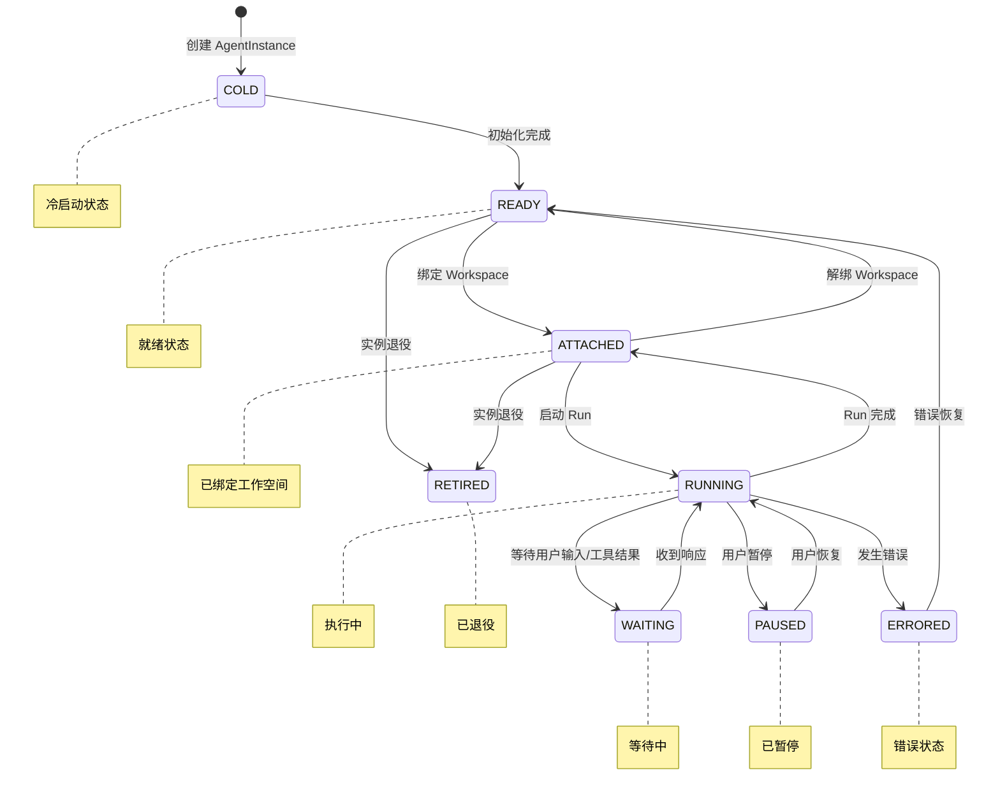
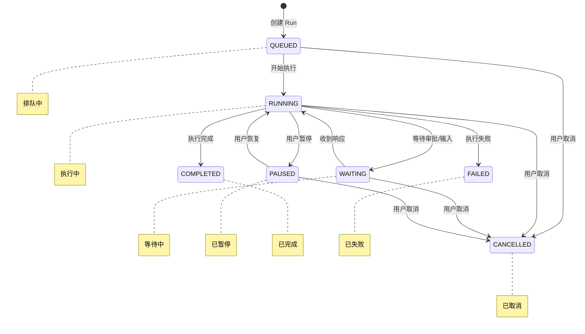
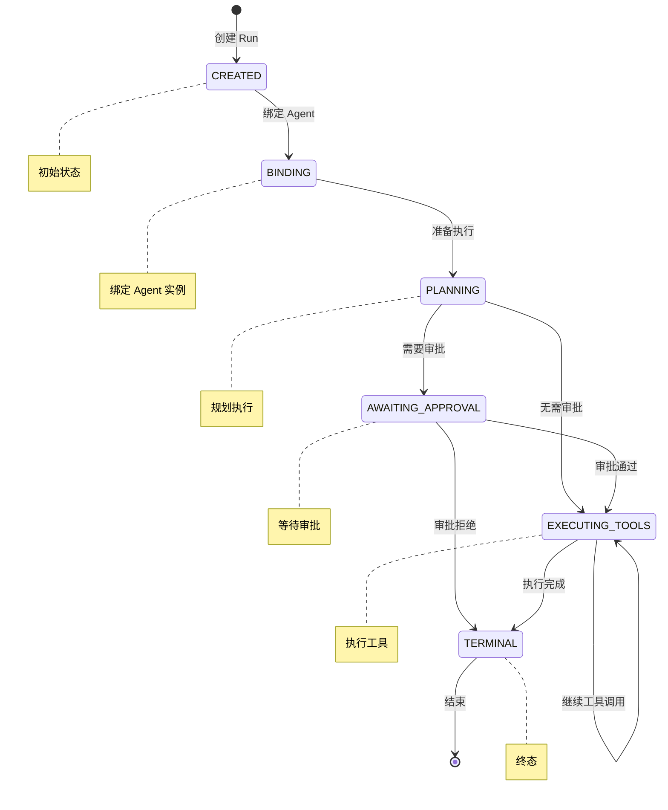
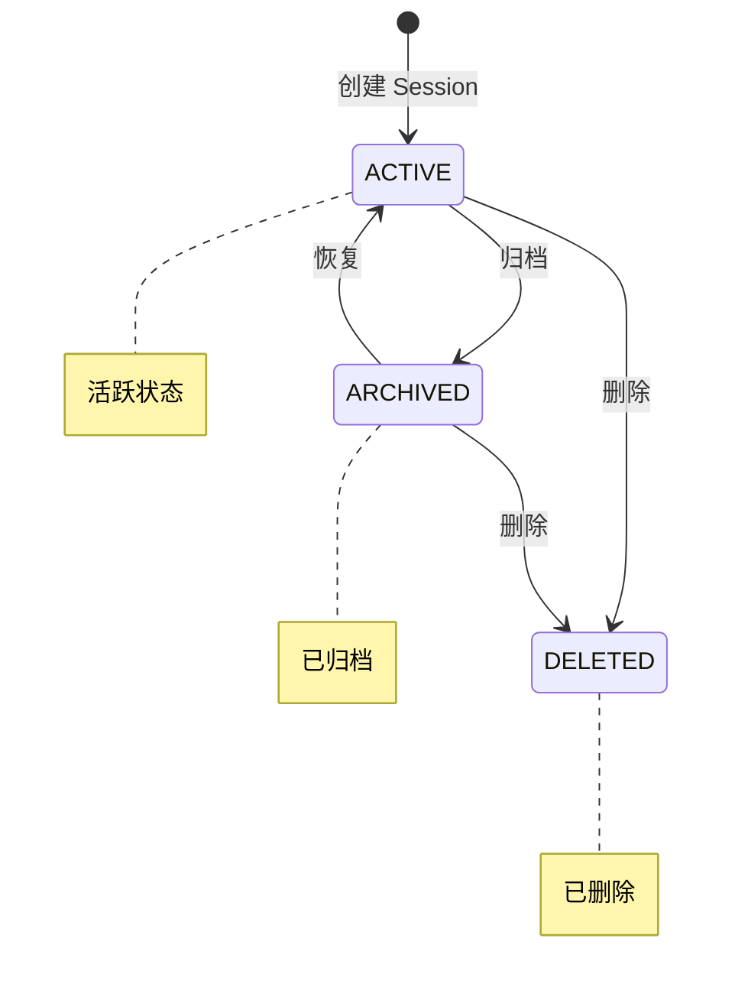
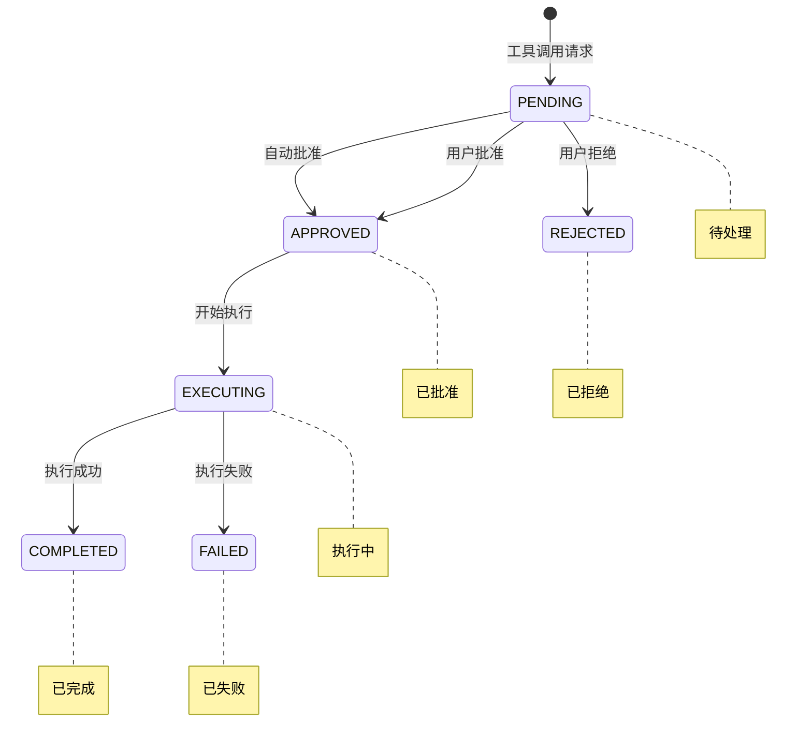
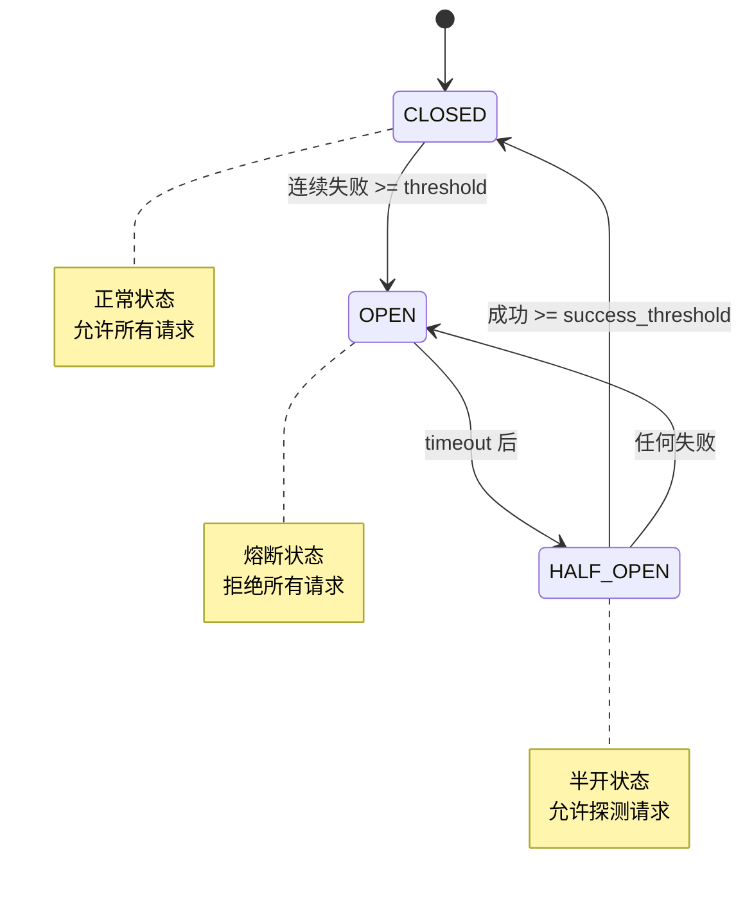
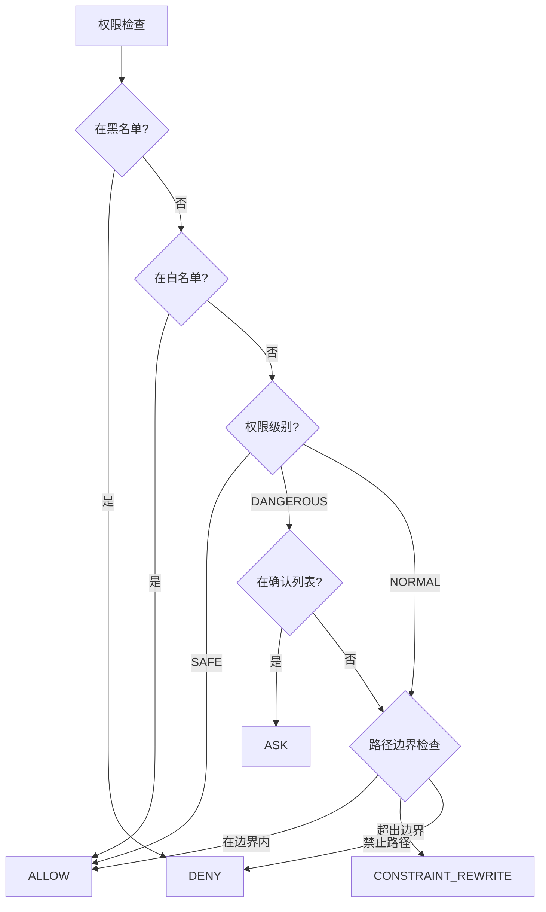

# Mini-Agent 状态机

## 1. 概述

本文档描述 Mini-Agent 中各实体的状态机设计，包括状态定义、转换条件、转换事件等。

---

## 2. AgentInstance 状态机

### 2.1 状态定义

| 状态 | 说明 |
|------|------|
| `COLD` | 冷启动，未初始化 |
| `READY` | 就绪，可绑定工作空间 |
| `ATTACHED` | 已绑定工作空间 |
| `RUNNING` | 执行中 |
| `WAITING` | 等待中（用户输入/工具结果） |
| `PAUSED` | 已暂停 |
| `ERRORED` | 错误状态 |
| `RETIRED` | 已退役 |

### 2.2 状态转换图

### 2.3 转换条件

| 当前状态 | 目标状态 | 触发事件 | 条件 |
|----------|----------|----------|------|
| `COLD` | `READY` | `initialize` | 初始化成功 |
| `READY` | `ATTACHED` | `attach_workspace` | 工作空间可用 |
| `ATTACHED` | `RUNNING` | `start_run` | 有消息待处理 |
| `RUNNING` | `WAITING` | `await_input` | 需要用户输入或工具结果 |
| `WAITING` | `RUNNING` | `receive_input` | 收到输入 |
| `RUNNING` | `PAUSED` | `pause` | 用户请求暂停 |
| `PAUSED` | `RUNNING` | `resume` | 用户请求恢复 |
| `RUNNING` | `ATTACHED` | `complete_run` | Run 完成 |
| `ATTACHED` | `READY` | `detach_workspace` | 解绑请求 |
| `RUNNING` | `ERRORED` | `error` | 发生不可恢复错误 |
| `ERRORED` | `READY` | `recover` | 错误恢复 |
| `READY` | `RETIRED` | `retire` | 退役请求 |
| `ATTACHED` | `RETIRED` | `retire` | 退役请求 |

---

## 3. Run 状态机

### 3.1 状态定义

| 状态 | 说明 |
|------|------|
| `QUEUED` | 排队中 |
| `RUNNING` | 执行中 |
| `WAITING` | 等待中（审批/用户输入） |
| `PAUSED` | 已暂停 |
| `COMPLETED` | 已完成 |
| `CANCELLED` | 已取消 |
| `FAILED` | 已失败 |

### 3.2 阶段定义

| 阶段 | 说明 |
|------|------|
| `CREATED` | 已创建 |
| `BINDING` | 绑定 Agent |
| `PLANNING` | 规划执行 |
| `AWAITING_APPROVAL` | 等待审批 |
| `EXECUTING_TOOLS` | 执行工具 |
| `TERMINAL` | 终态 |

### 3.3 状态转换图

### 3.4 阶段转换图

### 3.5 状态-阶段对应关系

| 状态 | 允许的阶段 |
|------|-----------|
| `QUEUED` | `CREATED`, `BINDING` |
| `RUNNING` | `PLANNING`, `EXECUTING_TOOLS` |
| `WAITING` | `AWAITING_APPROVAL` |
| `PAUSED` | 任意（保持原阶段） |
| `COMPLETED` | `TERMINAL` |
| `CANCELLED` | `TERMINAL` |
| `FAILED` | `TERMINAL` |

---

## 4. Session 状态机

### 4.1 状态定义

| 状态 | 说明 |
|------|------|
| `ACTIVE` | 活跃 |
| `ARCHIVED` | 已归档 |
| `DELETED` | 已删除 |

### 4.2 状态转换图

### 4.3 转换条件

| 当前状态 | 目标状态 | 触发事件 | 条件 |
|----------|----------|----------|------|
| `ACTIVE` | `ARCHIVED` | `archive` | 无活跃 Run |
| `ACTIVE` | `DELETED` | `delete` | 无活跃 Run |
| `ARCHIVED` | `ACTIVE` | `restore` | 工作空间可用 |
| `ARCHIVED` | `DELETED` | `delete` | 删除请求 |

---

## 5. ToolCall 状态机

### 5.1 状态定义

| 状态 | 说明 |
|------|------|
| `PENDING` | 待处理 |
| `APPROVED` | 已批准 |
| `REJECTED` | 已拒绝 |
| `EXECUTING` | 执行中 |
| `COMPLETED` | 已完成 |
| `FAILED` | 已失败 |

### 5.2 状态转换图

### 5.3 转换条件

| 当前状态 | 目标状态 | 触发事件 | 条件 |
|----------|----------|----------|------|
| `PENDING` | `APPROVED` | `auto_approve` | 权限级别为 SAFE |
| `PENDING` | `APPROVED` | `user_approve` | 用户确认 |
| `PENDING` | `REJECTED` | `user_reject` | 用户拒绝 |
| `APPROVED` | `EXECUTING` | `start` | 开始执行 |
| `EXECUTING` | `COMPLETED` | `success` | 执行成功 |
| `EXECUTING` | `FAILED` | `error` | 执行出错 |

---

## 6. CircuitBreaker 状态机

### 6.1 状态定义

| 状态 | 说明 |
|------|------|
| `CLOSED` | 正常状态，允许所有请求 |
| `OPEN` | 熔断状态，拒绝所有请求 |
| `HALF_OPEN` | 半开状态，允许探测请求 |

### 6.2 状态转换图

### 6.3 转换条件

| 当前状态 | 目标状态 | 触发事件 | 条件 |
|----------|----------|----------|------|
| `CLOSED` | `OPEN` | `failure` | 连续失败次数 >= failure_threshold |
| `OPEN` | `HALF_OPEN` | `timeout` | 距离上次失败 >= timeout_seconds |
| `HALF_OPEN` | `CLOSED` | `success` | 连续成功次数 >= success_threshold |
| `HALF_OPEN` | `OPEN` | `failure` | 任何失败 |

---

## 7. PermissionDecision 状态机

### 7.1 决策类型

| 决策 | 说明 |
|------|------|
| `ALLOW` | 允许执行 |
| `DENY` | 拒绝执行 |
| `ASK` | 需要用户确认 |
| `CONSTRAINT_REWRITE` | 需要重写约束 |

### 7.2 决策流程

---

## 8. 状态机设计原则

### 8.1 确定性

- 每个状态有明确的转换条件
- 同一事件在不同状态下的行为确定
- 避免歧义状态

### 8.2 完整性

- 覆盖所有可能的转换
- 处理异常情况
- 定义终态

### 8.3 可观测性

- 状态变更发布事件
- 记录状态历史
- 支持状态查询

### 8.4 可恢复性

- 支持从错误状态恢复
- 保存检查点
- 支持回滚